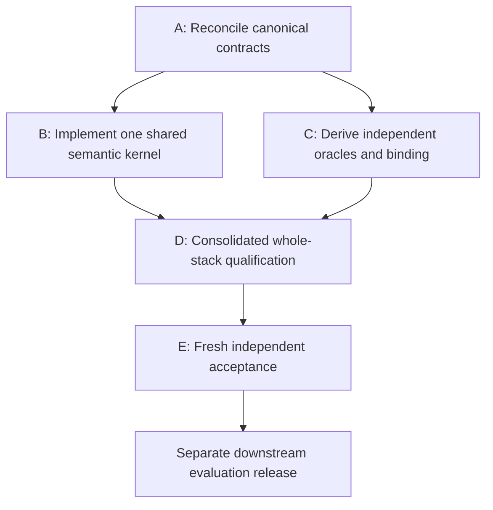

# IRIS full-system DEEP architecture, qualification and institutional assurance audit

**IRIS_FULL_SYSTEM_DEEP_AUDIT_COMPLETE**  
**Disposition: HOLD — NEW BASELINE REQUIRED; boundary D selected.**  
**ZERO_AUTHORITY · NO_GATE_PROGRESS · CONTINUITY_DEFAULT_OFF · STOP_FOR_STRATA**

Audit date: 2026-10-03 UTC. Sole substantive auditor: this ChatGPT Work session. No substantive or mechanical work was delegated to another agent. This is a source-level assurance disposition, not permission to repair, evaluate, admit, merge or operate IRIS.

## 1. Executive adjudication

IRIS is not yet sufficiently coherent or proven to continue toward admission on the present candidate/qualification baseline. F1 and F2 survive independent inspection, but do not bound the problem. The frozen candidate also contains inherited foundational failures in authority binding, verification, objective reconciliation, recovery/admission and continuation exclusivity. Transition code repeats several of those failures under different representations. Passing local tests can coexist with these defects because important requirements are checked through isolated helpers, permissive fixtures, incomplete assertions, or assertions that positively encode the incompatible behavior.

The selected boundary is **D — foundational IRIS contract/implementation rework before Pilot 001 continues**, followed by a **new whole-stack candidate and qualification baseline**. This does not require discarding IRIS's constitutional architecture, rebuilding all infrastructure, or regenerating replacement E1. The conceptual separations—evidence/Current, identity/authority, intent/receipt/effect, provider state/institutional state—remain valuable. Their enforcement and shared contracts must be repaired together. A Pilot-only patch would leave consequential callers and reconstruction paths inconsistent with the corrected projection.

The central failure is **distributed semantics without a single enforceable cross-layer contract**. It appears in five connected places: epistemic state; resolution identity; authority/effect lifecycle; canonical reconstruction; and qualification evidence. This diagnosis is supported by distinct source mechanisms, not inferred from defect count or historical scores.

The audit identifies 20 material causal classes below. Several are directly demonstrated by the authorized E1 shapes or repository test assertions; others are latent but reachable through the exported interfaces. No production incident is alleged. No candidate code, candidate tests, projection, evaluation or scoring was executed.

### What remains earned

- Immutable source history and the previous narrow acceptance receipt remain historical evidence.
- All **63 files** at accepted foundation head `bee076c69290922bfe141b9603763ac943619dfe` are byte-identical in candidate `185dbd1be80bd54c6cf5dcc085f105a637fe7e44`. The foundational mechanisms reported here are inherited, not transition regressions.
- The narrow foundation repair genuinely added intent-only reconciliation and early tool-contract mismatch rejection. Those mechanisms remain present; their local success does not establish the entire continuity or action lifecycle.
- Replacement E1's 40-case source population, identity and structural integrity remain usable. This audit found no demonstrated E1 population defect requiring regeneration. E2 answers were not inspected and are neither relabeled nor requalified here.
- Several useful negative controls and source-coverage repairs remain valid, bounded evidence. They must be retained inside the new qualification architecture.
- Operational promotion, live-provider durability, consequential effects and Persistent Continuity were already unearned. This audit does not erase an earned production state, because none is established by the inspected receipts.

## 2. Authority, Fresh Current, provenance and independence

Fresh Current was reconstructed from BIG-Navigator #703 and exact comments [5965679103](https://github.com/417properties/BIG-Navigator/issues/703#issuecomment-5965679103), [5965652948](https://github.com/417properties/BIG-Navigator/issues/703#issuecomment-5965652948), [5965601867](https://github.com/417properties/BIG-Navigator/issues/703#issuecomment-5965601867), and [5965552071](https://github.com/417properties/BIG-Navigator/issues/703#issuecomment-5965552071). The first is actually titled a **Pilot 001** full-stack release. The user's later direct instruction expands this audit to the foundational repository. That expansion is recorded as user authorization, not attributed falsely to the older GitHub text.

The inspected Current pauses binding repair, candidate execution and promotion. It preserves E1/E2 unless source-backed falsifiers arise. No canonical Current was edited. Publishing this report is the explicitly requested reporting action.

**Independence qualification:** earlier in this conversation, automatically supplied context exposed historical E3-result information. This was disclosed and an initial admission-failure return was posted at BIG #703/5965902859 and IRIS #3/5965903761. After the user's broader direct instruction, this source audit continued with that exposure disclosed. No historical score is reproduced, used as evidence, or used to configure findings. No protected E2 answer, candidate output vector or E3 artifact was fetched. This report **does not certify clean-room evaluator independence** and cannot substitute for a fresh independently admitted acceptance worker. Source-completion and independence are separate claims.

The reasoning controls consumed before substantive full-system review were:

1. `BSIC-DEEP-AUDITOR-ASSURANCE-INTEGRATION-v0.13.md`, whose actual subtitle is Phase-1 DEEP Auditor Assurance Integration v0.13; Library object `libfile_13ea0df89bf8819186ec8778d0dbab4f`.
2. `BIG_Predictive_Metacognition_Precognition_v2.0.docx`, `libfile_550ee6e78f9c8191b59caac18401bb87`.
3. The originally supplied Integrated DEEP Investigation + Predictive Metacognition v2 method.

The user's earlier withdrawal of a supposed missing governing file was respected; the subsequently located v0.13 was consumed under the newer directive. These are reasoning controls only. They confer no IRIS operational authority.

### Exact evidence baseline

| Evidence | Identity |
|---|---|
| Frozen candidate | commit `185dbd1be80bd54c6cf5dcc085f105a637fe7e44`; tree `af4808dc6c6db17ed7dc5cdd923fe5b9697c006a`; all 103 files |
| Accepted foundation | commit `bee076c69290922bfe141b9603763ac943619dfe`; tree `d73329469bf2a4393414cfa6db75a5c8cdef1157`; all 63 blobs unchanged |
| Foundation Blueprint v0.1 | 34,766 bytes; SHA256 `d634a1c54f14bb8e175bc87af0d98a1509a6d244ae9162b5daa7292789d919a2` |
| Foundation Builder Packet v0.1 | 10,096 bytes; SHA256 `23b93903621f607c551784f083f5136ca443cd11193023d82197d017e9a6b58a` |
| Transition Blueprint v0.4 | commit `cda075e0137571aaf9fcb4b752ce0085d361e0cb`; blob `c030c5f475f38d6edd4bda52ecd74d6f9d9eb786` |
| Replacement E1 | commit `849deca383add66773ab1ba0c8bc0ca852523c8f`; tree `fe0264a8fa5d0bc5ac7ee1dd9210f35dd97a6fc4` |
| E1 population | 40; SHA256 `32529f099c0f79d2b37782627cd6e8d7fd69ed6b4b9fbd390fddefeb0d0bac5f` |
| Binding package | HEAD `f571ad959a6d87514a69e2f9cf8695810714ddc7`; index blob `1496e47c4a23ae2b141abaad9b9fd024dacc231b`; all five indexed core artifacts |
| Whole-object review | commit `4ea6601df3ac20993a197f2f3d851c6cb6782433`; blob `54a821db7fc3c8bffe84ecf1b58b5331b1a00bd5` |
| Foundation narrow acceptance | IRIS #2/[5858150256](https://github.com/417properties/IRIS-Personal-Office/issues/2#issuecomment-5858150256) |

`SOURCE-INVENTORY.csv` binds every baseline candidate/blob input to exact bytes and SHA256. The foundation document hashes were independently reproduced against `governance/RELEASE-BINDING.md`. The 12 binding semantic dependency hashes agree with retrieved bytes. The additional E1 structural-checker source was read, not executed.

### Method and limits

All findings are **static source proofs or contract incompatibilities**, not observed candidate execution. Mechanical Python work was confined to byte/hash verification, source census, exact-reference resolution, lossless evidence factoring and report assembly. The four E1 shards were personally consumed through an exactly reversible presentation: 298 full/delta templates and all 40 case-to-template maps. Round-trip equality retained every field, scalar and relation; opaque IDs remained linked through exact alias maps. This was not a sample. No consequence classes, scores or candidate output vectors were generated.

Mechanical checks independently reproduced 611 source records, 221 impact packets, 832 unique record/packet IDs, 5,008 resolved reference occurrences, the population digest and the full record-type census. These prove identity/structure, not semantic correctness or independent authorship. Impact facts were consumed as source evidence and integrity context, not used to invent classification or scoring.

## 3. Complete material defect register and L1–L5 analysis

Severity **critical-path** means a defect could invalidate a future authority/effect or admission boundary if the seam is promoted. **High** means material correctness/assurance failure. **Material** means a necessary contract or evidentiary gap. All are bounded to the inspected baseline; potential blast radius is conditional.

Coordinates below refer to exact candidate paths at the pinned commit. Functions, named tests, SQL tables and document sections are unambiguous source coordinates. `F` denotes foundation Blueprint v0.1; `P` denotes transition Blueprint v0.4; `B` denotes standalone binding v1.0.

### D01 — Required identity totality is asserted but absent

**Subsystem/severity:** binding; High. **Owner:** IBA / architecture; Professor / STRATA owns the totality gate. **Demonstrated:** conflict-only root in E1 case `p1e1r4_80ccea1138af42d8843eabe2a10fec66`.

**Evidence/requirement:** B §7 specifies obligation/decision/intent IDs; §9.2 constructs the conflict-only root without its `id`. `PilotCandidate.id` is required (`pilot001-types.ts`). Matrix `candidate_field_census.id_unique=84` and Builder F098/F100/F107 claim completeness; F100 cites nonexistent §9.3. P §§10,13,15 require stable identity and reconstructable projection evidence.

- **L1:** one demonstrated root has no deterministic required candidate ID.
- **L2:** conflict identity is specified, but no function maps it and the case identity to `PilotCandidate.id`; the two identities are not interchangeable by inference.
- **L3:** totality checks counted roots/properties instead of requiring one value derivation per field and resolving every normative citation.
- **L4:** discretionary IDs alter serialized inputs, projection digest and run identity; apparent preflight completeness does not support downstream reproducibility.
- **L5:** fixing only this root permits the next unmodeled field or root kind to reintroduce decoder discretion.

**Competing explanation:** an implicit ID grammar was intended. No such normative conflict-root grammar exists in the standalone object, and historical bindings are forbidden reconstruction dependencies. **Hidden variable/root challenge:** if a separate authoritative compiler contract supplies it, the missing rule is packaging/ownership failure rather than semantic invention; none is in the permitted dependency closure. **Blast radius:** one demonstrated root; all future unmatched root constructors. **Control/proof:** architecture-owned field compiler and citation resolver; all 2,016 constructor-field cells yield exactly one derivation/domain/presence rule or explicit HOLD. No invented repair ID appears in this report.

### D02 — Epistemic uncertainty becomes positive Aaron relevance or disappears

**Subsystem/severity:** classifier/coverage/binding oracle; High. **Owner:** DEV / Builder; IBA owns shared UNKNOWN contract; Professor / STRATA owns oracle validation.

**Evidence:** `pilot001-classifier.ts::missingMaterialARDimension/classifyAaron` tests missing decision maker but not authority holder/delegation or owner. AR-3 uses `valid_delegation!==true`. `pilot001-coverage.ts::missingMaterialClassification` separately recognizes unknown authority. Classification test “reserved authority without a proven valid delegation…” and post-E3 test “fails closed to Aaron-required authorization” assert `unknown=false`. B authority-unknown representation preserves APPLICABLE/CURRENT/VERIFIED. P §14 requires item-level UNKNOWN for undecidable AR relevance.

- **L1:** F2's two authority roots take a known AR-3 branch while coverage is UNKNOWN. The E1 unknown-owner obligation is also not recognized as an item-level unknown.
- **L2:** omitted delegation conflates known absence with unavailable knowledge; owner comparison simply fails equality. The binding census calls only six roots load-bearing unknown and omits the separate unknown-owner root.
- **L3:** conservative escalation was treated as epistemic truth, while classifier and coverage maintain different incomplete unknown predicates.
- **L4:** UNKNOWN coverage can mask incorrect known items or missing item disclosure. In the unknown-owner case, the linked unknown decision already makes coverage UNKNOWN, so the actual demonstrated omission is a **missing item disposition**, not a demonstrated justified-omission claim. A known linked decision would expose the latent false-omission path.
- **L5:** repairing holder UNKNOWN alone leaves delegation-only, owner, omitted status and other dimensions vulnerable.

**Competing model:** P §9's “no valid matching delegation exists” means “none has been proven,” deliberately making AR-3 conservative. That reading can justify operational denial; it cannot override §14's explicit knowledge distinction. A known Aaron holder may independently prove AR-3 even if delegation is unresolved; the repair must preserve supported predicates rather than blanket-convert every partial fact to UNKNOWN. **Root challenge:** the deeper defect could be an underspecified three-valued predicate algebra; reconcile it explicitly. **Blast radius:** two F2 roots, one unknown-owner root, latent malformed/partial candidates. **Control/proof:** one shared fact-state algebra with per-predicate proofs; exhaustive known-valid/known-invalid/missing/unknown/stale/conflict/unavailable cases through item route and coverage together.

### D03 — Candidate-domain and destination totality are incomplete

**Subsystem/severity:** Pilot predicates/lifecycle/output; High. **Owner:** DEV / Builder; IBA for lifecycle/predicate contracts.

**Evidence:** `PilotCandidate` makes nearly every semantic field optional and statuses arbitrary strings. `classifyAaron` treats non-APPLICABLE (including missing) as omittable, but `justifiedOmission` accepts only APPLICABLE. Coverage checks explicit UNKNOWN, not absent/malformed candidate fields, stale candidates or candidate-only conflicts. AR-3 lacks an open required-step check; AR-4 accepts any material conflict/unresolved effect without separately proving Aaron judgment. P §§9,11,14–15; E1 protocol “AR, identity, conflicts and coverage.”

- **L1:** the six demonstrated SATISFIED/SUPERSEDED roots reach neither known, unknown nor justified omission; completeness can still be COMPLETE. Missing applicability has the same latent silent route. Candidate-local stale/conflicting evidence can coexist with COMPLETE when the separate aggregate inputs look healthy.
- **L2:** classification, omission, coverage and conflict arrays are independently authored filters without a conservation invariant. Required-step status/Aaron-judgment evidence cannot be faithfully validated from the present interface.
- **L3:** local positive predicates and coverage tests were substituted for an exhaustive domain/disposition partition.
- **L4:** terminal lifecycle evidence is lost from explainability; source health and item health can contradict. Principal-owned action, decision, permission and conflict lifecycles leak into each other when flags stand in for scoped evidence.
- **L5:** new status/token/optional-field combinations can disappear silently or trigger an unsupported positive class.

**Competing explanation:** terminal records intentionally disappear. That needs an explicit auditable disposition; P §14 prohibits equating absence with proven irrelevance. **Root challenge:** if terminal roots should never be constructed, B's 84-root universe and the candidate boundary must be reconciled together, not silently filtered. **Demonstrated blast:** six terminal roots and the unknown-owner route; latent stale/malformed/closed-reserved/no-judgment conflict tuples. **Control/proof:** discriminated root types, runtime validation and a root conservation ledger, with explicit permitted one-to-many resolution expansion. Every root must terminate in a justified destination or named HOLD; coverage must consume the same item facts.

### D04 — Resolution identity is reconstructed from lossy fields and overconsolidated

**Subsystem/severity:** anchor/duplicate/output interface; High. **Owner:** IBA / architecture and DEV / Builder.

**Evidence:** `rawObligationId` parses candidate ID in preference to explicit obligation ID. `anchorsFor` drops objective and most linked context. `consolidateStructuralDrafts` merges ACT drafts by obligation/objective fields, AUTHORIZE drafts by objective/class/holder/delegation, and absorbs every conflict-only draft on that objective. Post-E3 tests at the named “contextual objective,” “exact duplicate obligation roots,” and “one reserved-authority intervention” assertions encode these choices. P §10 permits consolidation only on exact principal/kind/anchor set; §15 requires canonical context refs. E1 protocol lines under deterministic anchoring requires explicitly linked anchors and exact permission-decision association.

- **L1:** different anchor sets can be joined; unrelated conflicts can be absorbed into authorization; contextual canonical refs required by the source contract cannot survive the output interface.
- **L2:** text parsing overrides typed fields; shared objective/authority attributes substitute for a source-proven resolution-equivalence relation. The binding omits association fields the candidate would need to distinguish multiple permission steps on one objective.
- **L3:** a repair optimized expected examples without defining canonical resolution objects and separate identity/context roles.
- **L4:** intervention identity, deduplication, provenance and downstream denominator integrity become coupled to synthetic candidate spelling and lossy grouping.
- **L5:** a second permission decision or independent conflict on one objective gets merged into an apparently successful single intervention.

**Competing explanation:** narrow resolution anchors are preferable to contextual anchors. This is a legitimate architecture choice only if reconciled with E1 and §15; it does not authorize merging unequal anchor sets or inferring unrelated conflict equivalence. **Root challenge:** the common cause may be a missing resolution intermediate representation, not a hashing bug. **Blast:** source-shaped anchor interface mismatch plus demonstrated contradictory test oracles; overmerge counterexamples latent beyond the 40-case census. **Control/proof:** explicit resolution key, exact linkage/equivalence evidence, separate context refs; alias/namespace tests; unrelated same-objective negative controls; no semantic parsing of opaque candidate IDs.

### D05 — Foundation authority and privacy are not principal/value/time bound

**Subsystem/severity:** orientation/policy gate; critical-path. **Owner:** DEV / Builder; IBA shared authority contract.

**Evidence:** `orient` maps explicit decisions to keys, ignoring their values and effective intervals; selects orientation by absent effective_to/version, without as-of validation. `evaluateAuthority` authorizes a matching key before policy examination, and both policy evaluators lack principal filtering. `runBoundedCircuit` passes every policy in the repository. INTERNAL_NONCONSEQUENTIAL has no action-consequence guard. F §§8.4,9; P §§3,27.

- **L1:** a denial-valued, future or expired explicit preference record can confer authorization; another principal's policy can authorize or contaminate privacy judgment.
- **L2:** scope-string equality replaces a typed, signed/current decision with affirmative value, subject, interval and applicable consequence class.
- **L3:** fixtures align all principals, scopes and positive values; policy APIs erase information needed to reject mismatches.
- **L4:** the same runtime can bypass the more detailed transition authority model entirely; privacy and intent-basis labels no longer prove the actual release authority.
- **L5:** adding live adapters turns a local semantic defect into unauthorized transmission or action.

**Competing model:** repository is assumed single-principal and orientation decisions only contain positive grants. Those preconditions are neither enforced nor specified by these types, and database permits multiple principal IDs. **Root challenge:** if a prior admission layer guarantees them, that layer must be mandatory on this public caller; none is present. **Blast:** latent reachable foundational action path and cross-principal read paths. **Control/proof:** principal-scoped repositories; typed decision value/validity/source binding; action-class checks; tests with denial values, future intervals, foreign policies and mismatched intent/episode/subject identities.

### D06 — Effect execution is not governed by persisted retry/reconciliation state

**Subsystem/severity:** runtime/tool boundary; critical-path. **Owner:** DEV / Builder.

**Evidence:** `runBoundedCircuit` skips insertion when intent ID already exists but always calls `act` using the caller's intent; it never calls `retryDisposition` or requires continuity/sentinel admission. `act` checks tool/scope/retry labels only. Executor rejection has no receipt/reconciliation conversion. F §§8.5–8.7,10; P §§4–5.

- **L1:** reusing a verified or unresolved intent can execute again; changed payload under the same ID can execute while stored intent remains old; transport exceptions escape the effect ledger.
- **L2:** persistence and retry policy are disconnected helpers, not an atomic action state transition with immutable intent identity.
- **L3:** retry tests exercise `retryDisposition` directly; circuit tests do not replay the same intent, vary its digest, or interrupt submission.
- **L4:** receipt/effect lineage can describe different payloads; D07/D09 can falsely make subsequent recovery look terminal.
- **L5:** an unsafe non-idempotent effect can be duplicated after timeout or process replacement.

**Competing model:** callers are responsible for single execution. That assumption contradicts the durable runtime's required recovery contract unless made an enforced gate. **Root challenge:** a central executor/state-machine boundary may be missing across both foundation and transition. **Blast:** exported circuit, any executor; no real effect executed in this audit. **Control/proof:** immutable intent/digest comparison, durable release ownership, retry adjudication and failure receipts on the actual call path; adversarial replay/crash tests with submission counters and reconstruction.

### D07 — Failure to observe the expected effect is labeled proven no effect

**Subsystem/severity:** verification; critical-path. **Owner:** DEV / Builder.

**Evidence:** `tools/verification.ts::verifyFixtureEffect` uses JSON equality and maps every inequality to VERIFIED_NO_EFFECT; expected value is a caller argument, not validated against the persisted intent/verification contract. F §8.7 requires five distinct dispositions; §10 requires proven no effect before retry.

- **L1:** a partial or different effect is represented as no effect.
- **L2:** binary fixture equality collapses absence, contradiction, uncertainty and wrong effect.
- **L3:** the negative control uses an unchanged fixture; it proves that one case, not all nonmatches.
- **L4:** continuity accepts VERIFIED_NO_EFFECT as terminal and retry policy can allow another attempt; the mislabel crosses both gates.
- **L5:** a partially landed external effect is repeated while evidence says it never happened.

**Competing model:** the function is fixture-only. True, and no live verifier is claimed; nevertheless its result is consumed as the canonical terminal disposition and is cited as verification/reconciliation evidence. **Root challenge:** if this is only a test simulator, production semantics still need a distinct verified interface and the qualification claim must be narrowed. **Blast:** all nonmatching fixture reads; future adapter generalization. **Control/proof:** verifier-specific proof obligations for no effect, partial effect, conflict and unavailable readback; bind expected effect and receipt request digest to persisted intent; preserve UNKNOWN until evidence discharges it.

### D08 — Task success closes arbitrary objectives without reconciliation

**Subsystem/severity:** objective/obligation/state machine; High. **Owner:** DEV / Builder.

**Evidence:** `runBoundedCircuit` closes the caller-selected obligation and marks the caller-selected objective SATISFIED after one VERIFIED_EFFECT; ignores success/closure criteria, other obligations, relationship checks and post-call authority/privacy. Failure sets objective OPEN regardless of prior terminal state. It returns EPISODE_CLOSED without closing a WorkEpisode. F §§4,7,8.8.

- **L1:** one fixture effect can satisfy a multi-obligation or unrelated objective; a failed later call can reopen a terminal objective silently.
- **L2:** direct Map mutation stands in for ObjectiveReconciler and guarded lifecycle transitions.
- **L3:** the sole bounded mission has one aligned objective/obligation; positive closure tests mirror that fixture.
- **L4:** reconstructed Current, learning and metrics inherit false completion; Pilot may omit genuine remaining work.
- **L5:** adding a second requirement or changing authority during execution produces false institutional closure.

**Competing model:** caller preconditions guarantee the one-obligation mission. That bounds the demonstration, not the exported reconciliation claim. **Root challenge:** objective criteria may be merely prose with no decidable evidence contract; if so architecture must specify closure adjudication, not just add tests. **Blast:** foundational circuit state mutations. **Control/proof:** explicit scoped reconciliation and authorized terminal transitions; multi-obligation, contradictory-evidence, parent-link mismatch, criteria-unsatisfied and mid-flight policy-change controls.

### D09 — Recovery/admission predicates disagree and undercheck reconstruction

**Subsystem/severity:** state/transition continuity; critical-path. **Owner:** DEV / Builder.

**Evidence:** `state/continuity-admission.ts` correctly distinguishes terminal dispositions and retains coexisting unresolved ones, but otherwise admits based on absence of unresolved effects and stateVersion. `agent-transition/persistent-objective-runtime.ts::reconstructRuntime` treats **every verification** as terminal. `getObjectives` defaults to `aaron`; Pilot principal is exact `AARON`; open obligations are unscoped. T26/T27 assert only obligation count. F §8.9; P §6.

- **L1:** ambiguous/UNKNOWN/CONFLICT effects disappear from transition reconstruction; foundation admission can return admitted without principal/orientation, policy, freshness or continuation ownership validation.
- **L2:** duplicate terminal predicates and an effect-only admission shortcut replace the eight-step continuity contract.
- **L3:** recovery was qualified at individual functions, and transition tests inherited a convenient fixture without exercising unresolved states.
- **L4:** safe foundation reconciliation can be bypassed by another recovery surface; provider replacement does not reconstruct the same institutional state.
- **L5:** replacing a worker/context can lose the very ambiguity intended to prevent retry.

**Competing model:** `continuity_admitted:false` in transition output makes it harmless. It prevents a literal admission claim, but does not make the reported unresolved-effects set truthful. **Root challenge:** the system lacks a single canonical recovery model. **Blast:** demonstrated source branch incompatibility; latent reconstruction/admission calls. **Control/proof:** shared disposition reducer, explicit principal mapping, staged admission evidence, and identical reconstruction assertions across memory/SQL/replacement-process paths; preserve the good foundation intent-only controls.

### D10 — Continuation generation is not exclusive ownership

**Subsystem/severity:** WorkEpisode concurrency; critical-path. **Owner:** DEV / Builder; IBA continuation contract.

**Evidence:** `episode-controller.ts::claimContinuation` rejects an active equal/higher generation, but accepts a newer generation without ending/revoking the old one. Migration 002 uniqueness is only `(causal_episode_id,episode_generation)`. F §6 requires one active continuation/CAS.

- **L1:** two active episodes of different generations can claim the same causal episode.
- **L2:** monotonic generation comparison is mistaken for atomic ownership transfer/fencing.
- **L3:** tests collide the same generation, not overlapping successor/predecessor execution.
- **L4:** duplicate actions, events and lessons become possible; D06/D14 have no mandatory fencing check.
- **L5:** recovery under a slow predecessor produces two workers acting on the same causal work.

**Competing model:** successor claim implicitly revokes the predecessor. Neither stored ended_at nor a release-time fence enforces that implication. **Root challenge:** if execution ownership actually belongs to a workflow engine, its fencing token still must cross the canonical action boundary. **Blast:** reachable memory state and SQL representation. **Control/proof:** atomic compare-and-transfer, active uniqueness/fencing, predecessor rejection after successor admission; model both schedules without live providers.

### D11 — Canonical-state access and persistence do not enforce the claimed semantics

**Subsystem/severity:** repository/Current/durability; High. **Owner:** DEV / Builder; IBA repository contract.

**Evidence:** `CanonicalRepository` exposes mutable Maps. `getActiveCurrent` returns a live reference; mutation bypasses version increments. `publishCurrent` versions by key but does not validate qualification/evidence/time/principal; `getActiveCurrent` uses absent effective_to, not as-of intervals. Snapshot import trusts arbitrary JSON. `PostgresCanonicalRepository` provides only connectivity, two reads and instrumentation insertion, not the canonical repository contract. F §§4–6,8.1–8.3,18; P §§6,21.

- **L1:** persisted bytes and exported snapshots are not sufficient evidence of correctly reconstructed Current; runtime/SQL repositories are not substitutable.
- **L2:** storage containers and mutable records substitute for canonical command/query invariants.
- **L3:** fresh-process tests reconstruct serialized memory fixtures; static SQL checking counts table names. Live SQL recovery was explicitly deferred, but the architecture-to-runtime adapter gap is broader than an unexecuted provider test.
- **L4:** silent mutation defeats stateVersion admission and correction propagation; projections can select a future or invalidated assertion as active.
- **L5:** moving to SQL exposes different FKs/types/transactions while prior memory tests remain green.

**Competing model:** memory is intentionally a local simulator. Accept that limitation; it cannot qualify canonical durability without a common semantic contract. **Root challenge:** if repository abstraction is itself wrong, adding SQL methods piecemeal repeats the loop. **Blast:** all canonical consumers. **Control/proof:** principal/as-of/version-aware immutable reads and validated commands; common repository conformance suite, schema-backed reconstruction, transactional event/version updates and malformed snapshot rejection. Live provider proof remains separately gated.

### D12 — Schema/domain/runtime admissibility domains diverge

**Subsystem/severity:** migrations 001–006 and domain types; High. **Owner:** DEV / Builder; IBA lifecycle/serialization reconciliation.

**Evidence:** foundation ObligationStatus has CLOSED/UNKNOWN but no SATISFIED/SUPERSEDED/ABANDONED; governance and E1 use the latter. Foundation owner EXTERNAL differs from E1 EXTERNAL_ORG. Principal is unconstrained text while runtime defaults differ in case. CurrentAssertion lacks principal/privacy fields; F §9.3 requires privacy classification across canonical entities. Most canonical types/tables lack F §18's schema_version. ActionIntent.expected_effect is string while SQL is jsonb and fixtures pass objects. The declared CanonicalRepository lacks getActiveCurrent although perceive calls it. SQL 005 has UUIDv7/prefix/credential-boundary/lease requirements absent from runtime fixtures. Its JSON CHECK on bounded_validity keys can evaluate NULL for missing keys and therefore is not a total required-key check.

- **L1:** a fixture can be accepted locally while unrepresentable under the schema; schema states can lack runtime lifecycle meaning.
- **L2:** independent representations have no explicit versioned decoder/domain translation or shared validation.
- **L3:** type stripping and table-name checks bypass TypeScript contract checking and SQL constraint behavior.
- **L4:** foundation-to-Pilot reuse is nominal; applicability/status and identity normalization become discretionary adapter work.
- **L5:** a real database integration “repair” silently collapses lifecycle/UNKNOWN states or weakens constraints to fit fixtures.

**Competing model:** E1 is a synthetic external source schema and need not equal SQL. Correct; the defect is the missing total cross-layer translation and incompatible claimed runtime contract, not different external spelling by itself. **Root challenge:** a versioned canonical schema owner may be missing. **Blast:** all adapters, source decode and reconstruction. **Control/proof:** explicit mapping with no implicit case-folding; typecheck-only gate; SQL constraint tests including NULL/missing JSON keys; round-trip every admitted lifecycle/identity/UNKNOWN state. Do not “fix” by changing E1 to resemble the candidate.

### D13 — Lease validation is not full Current authority validation

**Subsystem/severity:** identity/authority; critical-path. **Owner:** DEV / Builder.

**Evidence:** `authority-lease.ts::validateLease` does not call `validateWorkerProfile`; ignores profile expiry/identity match, worker kind/principal/revocation_ref, generation row's principal/capability/operation/privacy digest, future issuance, latest lease-state history and ActionIntent binding. `issueLease` checks only a small subset. `identity.ts::replaceWorker` can receive the same ID or an already used ID without invoking issuance validation. P §§2–5,27.

- **L1:** mutually matching supplied fields can pass despite an expired/misbound worker or inconsistent authority domain; successor construction does not guarantee nonreuse.
- **L2:** caller-provided context is treated as canonical truth; some identity checks exist but are not composed into release validation.
- **L3:** T08–T17 is one test with three negatives, not the full named matrix; SQL constraints and helper checks are assumed to cover runtime.
- **L4:** replacement, expiry, reauthorization and retained-session boundaries depend on which entry point is used.
- **L5:** a new caller forgets one precheck and revives stale institutional permission.

**Competing model:** SQL issuance triggers supply omitted constraints. They do not prove current expiry, latest history or intent match at release, and pure validation tests are not schema-backed. **Root challenge:** authority context needs an unforgeable validated snapshot/proof, not a bag of matching strings. **Blast:** latent reachable lease/replacement APIs. **Control/proof:** one total canonical validator including all identity/domain/intent fields and epistemic states; negative mutation of each dimension; transactional issuance/event/state correspondence.

### D14 — Sentinel does not model one-time atomic compare-and-release

**Subsystem/severity:** Sentinel/effect boundary; critical-path. **Owner:** DEV / Builder.

**Evidence:** `sentinel.ts::validateAndRelease` validates then awaits submit; no durable PREPARED write, generation lock/fence, status guard, attempt/lease/intent/digest binding, unique release transition or exception reconciliation. prepareReleaseAttempt fabricates operation_digest from intent ID. T21 calls it once and asserts one adapter call. P §4 permits a pure state machine/fake adapter but requires the modeled one-time linearization invariant.

- **L1:** repeated calls or a pre-submitted attempt can submit again; a stale context can pass immediately before a changed generation; a thrown transport error is not classified.
- **L2:** a stateless function has neither the ownership token nor durable transition needed to enforce the contract.
- **L3:** “one call in one test” was mistaken for “at most one release under retries/interleavings.”
- **L4:** lease correctness cannot establish effect safety; D06 remains a separate bypass around this seam.
- **L5:** promotion to a real broker preserves a validation/submission race and ambiguous-retry exposure.

**Competing model:** database locking is deferred. Live locking may be deferred; an honest fake model must still reject repeated release, model revoke-first/submit-first schedules and durable recovery. **Root challenge:** if one-time release is delegated to provider idempotency, that does not replace authority-generation ordering. **Blast:** fake boundary currently; potential consequential broker. **Control/proof:** single release state machine used by all callers; durable one-time intent ownership; exact operation digest; exception classification; schedule/crash matrix proving linearization without provider access.

### D15 — Snapshot proof and audit identity are lost at the projection boundary

**Subsystem/severity:** projection repository/output; High. **Owner:** DEV / Builder; IBA snapshot/run contract.

**Evidence:** `capabilities.ts` exposes buildProjection directly. `transition-repository.ts` has a genuine bounded read/rerun mechanism, but SqlExecutor has no transaction-affinity contract, readDependencies only hashes rows, and final output discards those dependency hashes. `pilot001-projection.ts::loadBearingDigest` hashes reduced inputs, omitting bracket/time/contract-row versions; projection_id is its 16-hex prefix. `appendProjection` stores only known items and no pilot001_source_evaluation rows. P §§12–16, SQL006.

- **L1:** public completeness can be caller-asserted; unchanged semantic input across independent runs yields the same primary-key ID; final digest does not identify the actual checked dependency snapshot; required audit rows are absent.
- **L2:** a pure renderer and a verified repository operation share the same public role; content identity is conflated with run identity and coverage evidence is discarded.
- **L3:** concurrency tests often supply the expected bracket enum; later fake-SQL tests improve the read loop but do not prove transaction affinity, expiry-only drift, append completeness or repeated-run persistence.
- **L4:** readback cannot reconstruct why a coverage decision was made; concurrency or foreign/nonsemantic row changes can overinvalidate, while clock-only freshness changes can evade row comparison.
- **L5:** repeated independent projections collide or a stale freshness proof is emitted as stable.

**Competing model:** content-addressed runs intentionally deduplicate. P §13 calls concurrent projections independent immutable runs; even intentional dedup needs separate occurrence identity and bracket evidence. **Root challenge:** snapshot proof may need to be a first-class input capability, not a boolean. **Blast:** exported projection/persistence interfaces; time/connection failures are conditional risks, not observed database incidents. **Control/proof:** mandatory verified entry point, explicit connection/transaction ownership, exact load-bearing dependency and as-of proof, distinct run/content identities, full source and disposition persistence; tests for identical concurrent runs, expiry without row mutation and dependency-version-only change.

### D16 — Workflow resume trusts a qualification label and ignores replay constraints

**Subsystem/severity:** workflow durability; High. **Owner:** DEV / Builder.

**Evidence:** `workflow-durability.ts` omits evidence/qualification refs and validated workflow/step/payload linkage. resumeDisposition accepts QUALIFIED_WORKFLOW/resumable with no unresolved refs; ZERO_EFFECT+NO_AUTOMATIC_REPLAY is permitted, and EFFECTFUL+READ_ONLY_SAFE returns RESUME_ZERO_EFFECT. P §26.2 requires exact qualification and no effect replay solely from durability.

- **L1:** mutually inconsistent labels can authorize a resume disposition; claimed payload qualification is not checked.
- **L2:** enum checks replace proof of checkpoint identity, evidence, integrity, supersession and permitted replay.
- **L3:** tests vary single flags on a presumed qualified object rather than falsifying the qualification claim or cross-product of effect/replay states.
- **L4:** replacement worker identity can be fresh while the resumed work is stale or unsafe; D09 ambiguity loss compounds the risk.
- **L5:** checkpoint hydration turns provider/session residue into apparently authoritative workflow progress.

**Competing model:** RESUME_ZERO_EFFECT does not itself execute an effect. True; the defect is an invalid resume classification, not an observed effect. **Root challenge:** a trusted checkpoint constructor could discharge these preconditions, but no such mandatory interface exists. **Control/proof:** typed qualified checkpoint with evidence/digest verification and cross-field validation; all effect/replay combinations, supersession/expiry and replacement-assignment tests. No workflow tables or live workers are required to prove the local contract.

### D17 — Capability/procedure eligibility is detached from the selected candidate

**Subsystem/severity:** routing/qualification/procedures; High. **Owner:** IBA interface; DEV / Builder implementation.

**Evidence:** routeCapability never matches candidate_id to qualification.capability_candidate_id, ignores required tools/procedures/capabilities/resource/evidence constraints absent from its request type, and invents cost+latency ranking. T91 uses different candidate IDs with the same qualification and asserts only ROUTED. The foundational CognitionRouter likewise accepts privacy/modality/reasoning-limit fields without enforcing them against provider capability profiles. admitQualification accepts PASS/evidence without the SQL admission fields; standalone PortableProcedure replaces canonical CapabilityProcedure with a qualified boolean/provider list. P §§28–30.

- **L1:** one candidate's qualification can select another; constrained routing requirements cannot be expressed or checked.
- **L2:** metadata labels replace exact candidate/role/population/version qualification and canonical procedure compatibility.
- **L3:** local seams were compressed beyond the architecture contract, with success-state assertions instead of selected-identity and constraint proofs.
- **L4:** apparently qualified provider substitution can change tool/privacy/evidence capabilities; two capability truth representations drift.
- **L5:** cheaper but unqualified or incompatible candidates acquire work assignments while the result still says authority NONE.

**Competing model:** no live routing is in scope. Correct; these are defects in the required deterministic local seam, not a demand for live evaluation. **Root challenge:** qualification must be an exact evidence-bearing relation, not a reusable badge. **Blast:** latent route/procedure calls; explicit weak test fixture. **Control/proof:** shared canonical capability/procedure types and versioned eligibility proof; cross-candidate qualification swap, missing-tool/context/privacy/resource constraints and expired/superseded evidence negatives; policy-defined ranking after eligibility.

### D18 — Selective perception collapses evidence qualification into persistence permission

**Subsystem/severity:** privacy/perception; High. **Owner:** DEV / Builder; IBA envelope contract.

**Evidence:** `selective-perception.ts::Perception` lacks source/provenance/privacy/relevance/qualification-ref fields; EVIDENCE_CANDIDATE plus qualified=true returns persist=true, evidence=true, ignoring expiry and permitted retention. P §31 separates relevant observation, qualified evidence and permitted persistence. T101 compares a string to itself.

- **L1:** a qualified flag is sufficient to persist; the contract cannot represent privacy-applicability UNKNOWN or retention denial.
- **L2:** qualification and persistence authorization are one boolean.
- **L3:** tests cover sensor availability and unqualified=false, never independently qualified-but-private/expired/irrelevant observations.
- **L4:** nominal privacy exclusion at the Pilot surface can be undermined by earlier persistence; device provenance can be overread by later adapters.
- **L5:** adding sensor plumbing retains data that should have been dropped even though no Current write occurs.

**Competing model:** the return is merely a recommendation. It still misstates the required pure validator's disposition. **Root challenge:** permission to retain may need a separate policy proof consumed by storage. **Blast:** local disposition only today; future ingress privacy. **Control/proof:** full SelectiveObservationEnvelope, independent relevance/provenance/privacy/retention predicates and negative controls; retain ambient quarantine and no-direct-Current constraints.

### D19 — Episode records and metrics cannot prove independent experience

**Subsystem/severity:** instrumentation/learning/causal identity; Material. **Owner:** IBA causal-measurement contract; DEV / Builder; Professor / STRATA qualification claims.

**Evidence:** IEF/BIRE event IDs incorporate work-episode/array position; learning ID is work_episode_id, not a causal-occurrence/evidence recurrence identity. Repeated circuit calls overwrite same-episode learning at version 1, while successor episodes can create separate lessons for the same causal episode. Circuit metrics hard-code retries=0 and mechanical interventions=0. F §§6,13–14 and restrained learning distinction; DEEP causal-counting controls.

- **L1:** stored events/lessons do not distinguish independent occurrence, repeat observation, retry and reconstruction sufficiently for institutional recurrence claims.
- **L2:** representation identity is used where causal identity and measured events are needed.
- **L3:** local success/zero external-call metrics are easy to assert; no test conserves one causal experience across workers/replays.
- **L4:** counts can inflate apparent evidence and hide recovery cost; overwritten learning loses its own history.
- **L5:** later promotion machinery treats repeated descriptions of one episode as repeated independent support.

**Competing model:** learning always remains CANDIDATE. This is true and bounds severity: no false mastery promotion is demonstrated. **Root challenge:** if all metrics are expressly fixture instrumentation, the immediate repair is honest measurement semantics plus future recurrence gating, not a new learning service. **Blast:** current evidence history; conditional future institutional learning. **Control/proof:** occurrence→observation→record→descendant identity, append/supersession and replay-aware counters; no promotion based on record count; duplication/reconstruction invariance tests.

### D20 — Qualification gates measure local consistency and overstate invariant coverage

**Subsystem/severity:** assurance/institutional process; High. **Owner:** Professor / STRATA; DEV owns assertions, IBA owns traceability.

**Evidence:** contradictory oracles D02/D04; T26/T27 count-only recovery; T08–T17 three checks; T21 one submission; T69–T71/T75–T80/T101 literal assertions; T86 unchanged local identity assertion; schema checker table-name/README checks; post-E3 example-specific grouping tests; Builder summaries carry historical 56/165 counts without establishing present complete semantics. Exact foundation receipt explicitly says narrow recheck of two falsifiers.

- **L1:** green evidence can coexist with false whole-system claims.
- **L2:** names/counts/shape presence are treated as proof of corresponding requirements; local helper correctness does not imply callers use it.
- **L3:** ownership and review sequencing lack a required complete architecture→representation→caller→oracle→evidence trace. Reactive repairs can install new unsupported semantics.
- **L4:** a narrow PASS is inherited as a broad premise; binding preflight then assumes the candidate interface is sound, concealing cross-layer defects.
- **L5:** the next reviewer discovers a different member of the same class and restarts the loop.

**Competing model:** acceptance was intentionally narrow and honest. For #5858150256 this is supported; the defect is broad reliance and incomplete qualification, not proof the reviewer falsified results. **Root challenge:** model weakness, context burden, organizational ownership or reasoning-substrate correlation may contribute, but source evidence does not establish the identity/capability of prior models or dishonest intent. **Blast:** qualification confidence across all reported classes. **Control/proof:** one integrated invariant owner; independent oracle derivation; executable/static negative proof linked to actual callers; exhaustive domain matrices; receipt scope explicitly narrower than unproven claims; fresh acceptance after one consolidated repair, not score-driven patching.

## 4. Blueprint traceability and test-oracle integrity

The attached **FOUNDATIONAL-TRACEABILITY.csv** (31 requirement groups) and **PILOT001-TRACEABILITY.csv** (38 groups) cover the load-bearing foundation and transition clauses, including documentary-only exclusions. Each row binds requirement, implementation, test location, historical evidence claim, status and defect IDs. Grouping follows a shared invariant rather than one row per sentence; no deferred live service is treated as an already required operational implementation. **TEST-SOURCE-INDEX.csv** records all 157 literal test declarations in 27 test files, with source lines; generated test cases make this different from a runtime test count. The shared helper file is also consumed. No tests were run. The historical Pilot summary also reports strict TypeScript candidate-source checking and PGlite/PostgreSQL-WASM migration application (35 tables, 18 new tables, seed/column checks). Those are stronger claims than the repository table-name checker, and are preserved as reported historical evidence. They do not establish full foundation TypeScript conformance, semantic constraints, transaction/recovery behavior, or the present whole-stack oracle; their execution was not reproduced in this audit.

### Qualification matrix audit

| Named proof surface | What the inspected assertion actually establishes | What remains false/unproved |
|---|---|---|
| Foundation domain tests | Some immutable-evidence/version and primitive behavior | Public-map mutation, schema_version, principal/as-of/invalidator enforcement; D11–D12 |
| Foundation authority/privacy | Missing/UNKNOWN and explicit matching scope cases; early contract mismatch rejection | Decision value/time/principal, action consequence class, stored intent/decision binding; D05–D06 |
| Foundation circuit | One aligned positive fixture and tool-success-without-expected-effect control | Partial/wrong effect; unrelated/multiple obligations; criteria; repeated intent; post-call authority; D06–D08 |
| Foundation continuity failure | Intent-only, unverified receipt, nonterminal/coexisting effects correctly block the foundation helper | Full eight-step admission; transition equivalent; successor fencing; D09–D10 |
| Foundation effect retry | retryDisposition's enumerated answers | Actual executor obeys those answers; D06 |
| Foundation reconstruction/fresh process | Memory snapshot survives genuine child-process replacement without predecessor session | SQL semantic parity, provider infrastructure, Current qualification/admission correctness; D09–D12 |
| Provider substitution | Local router choice/normalization and fixture state invariance | Real provider/session/worker transfer, privacy/modality/reasoning constraint compliance; D17 |
| BIG separation | Quarantine/control flags and absence of direct canonical writes on inspected seam | End-to-end principal filtering and privacy; constant assertions add no assurance |
| T01–T06, T86–T88 | Identity shape, selected replacement/revocation checks | Expired profile through lease path; arbitrary successor reuse; actual provider substitution |
| T07–T20 | Selected lease equality/state/generation/unresolved tests | Every Current field and epistemic state, atomic generation history, all stated revoke timings |
| T21–T23 | A single fake submit succeeds; explicit ambiguous result recovers; credential field absent | Check/release race, repeat invocation, crash/exception, durable one-time record and exact operation binding |
| T24–T28 | Fixture objective/obligation counts and continuity false | Actual unresolved-effect/authority/assignment reconstruction |
| T29–T38 | Known positive AR predicates and several negatives | Full unknown/status/judgment/required-step state domains; F2 oracle is contradictory |
| T39–T43 | Exact helper hashes and supplied conflict flag examples | Full source resolution identity and unequal-anchor nonconsolidation; post-E3 tests contradict it |
| T44–T54g | Stronger required-source runtime-shape/missing/stale/partial controls | Candidate field totality, all item dispositions, privacy exclusion linkage and candidate/source contradictions |
| T55–T56 | Enum-based tests only assert supplied status; repository-bracket tests genuinely exercise bounded fake-SQL rereads | Connection affinity, clock-only freshness drift, true dependency digest, independent run persistence |
| T57–T63 | Synthetic weight/arithmetic/negative gates and rejection of governing scoring context | Architecture correctness, source-linked metric inputs, causal independence or actual E3 performance |
| T64–T67 | No-authority helper, ambient quarantine/no automatic persistence | Complete governed entry point and selective evidence/persistence qualification |
| T68–T71 | Quarantine invocation; remaining literals | Wrong-principal exclusion and nonmutation are not proved by `'OTHER' != 'AARON'` or equal strings |
| T72–T74 | Declared zero effect/authority fields checked; local replacement fixture | Worker provenance, actually zero effects, canonical state nonmutation under an integrated worker |
| T75–T80 | Literal string/number assertions | PR state, ancestry, credential/provider activity, deployment/continuity/authority facts require independent evidence |
| T81–T85 | Selected checkpoint label combinations | Qualification/digest/lineage, all replay/effect combinations and actual recovery |
| T89–T94 | Role/demotion/benchmark flags and one privacy/risk filter | Qualification bound to selected candidate, full constraints, admission history and exact evidence |
| T95–T97 | No authority returned, retirement and provider mismatch | Superseded/unqualified/context/tool/privacy/capability compatibility cross-product; title overstates T96 |
| T98–T101 | Sensor availability/unqualified booleans; one expiry; a tautology | Independent permission to persist and device/source/principal truth |

### All post-E3 repair assertions, adjudicated

These tests were consumed as qualification source, not as E3 results.

| Assertion | Disposition |
|---|---|
| “contextual objective does not pollute a decision intervention identity” | **AMBIGUOUS_ARCHITECTURE / interface incompatibility.** Narrow identity anchors are a possible design, but conflict with the frozen source protocol's linked-anchor requirement and omit §15 context. Requires reconciliation, not automatic endorsement. |
| “exact duplicate obligation roots consolidate before intervention hashing” | **CONTRADICTORY_TEST_ORACLE.** Fixture intentionally supplies two different raw IDs and one shared field; expects union of unequal anchors. No source-proven equivalence/canonical anchor is supplied. |
| “material conflict does not erase underlying Aaron action” | Preserves a valid separation principle. **WEAK_TEST** for complete resolution context and explicit judgment; must remain with stronger invariant controls. |
| “unresolved effect selects RECONCILE_EFFECT” | A useful local positive precedence check. Does not test the demonstrated intent's UNKNOWN applicability, or whether independent resolutions are lost. |
| “one reserved-authority intervention may consolidate obligation decision and authority conflict” | **CONTRADICTORY_TEST_ORACLE.** A shared objective/class is not a source-proven single permission/conflict resolution; test authorizes structural overmerge. |
| “no proven valid delegation … Aaron-required authorization” | **CONTRADICTORY_TEST_ORACLE.** F2 directly sets authority holder UNKNOWN and asserts known AR-3. |
| “COMPLETE requires explicit non-partial evidence” | **CONFORMANT local repair.** Missing partial is UNKNOWN, explicit partial is INCOMPLETE. Preserve it; extend totality to candidates and callers. |

The post-E3 suite therefore contains both useful invariant repairs and symptom-specific assertions. It is not globally invalid, but it cannot be inherited as the oracle for the corrected architecture.

## 5. UNKNOWN taxonomy and cross-interface path matrix

This taxonomy records different unknowns rather than inventing a single “unsafe” flag. “Current code” means static branch behavior. It is not a generated candidate output vector or E2 answer.

| Unknown dimension / source | Representation through domain/candidate | Classifier → coverage → projection | Runtime consequence / required correction |
|---|---|---|---|
| Source unavailable | E1 UNAVAILABLE maps present=false, partial=true while known metadata remains known | Required applicable source → INCOMPLETE; supported items can remain; no complete omission | Preserve known absence separately from epistemic unknown |
| Source availability UNKNOWN | E1 authority envelope UNKNOWN; source tuple identity/applicability/freshness UNKNOWN | Coverage UNKNOWN; item flags retain independent known health; F2 then wrongly becomes known AR3 | Operational HOLD and item epistemic UNKNOWN must coexist |
| Source identity UNKNOWN/CONFLICT | Current qualification or candidate source_identity | Candidate returns unknown; coverage UNKNOWN | Good local fail-closed branch; missing value must not bypass it |
| Principal match unknown | E1 packet principal UNKNOWN becomes principal_match=false plus identity UNKNOWN | Source coverage UNKNOWN; boolean cannot distinguish known foreign from unknown match | Preserve tri-state match; foreign data needs separately justified exclusion |
| Freshness UNKNOWN | Required SourceEvaluation or candidate freshness | Explicit UNKNOWN blocks COMPLETE; candidate becomes unknown | Missing candidate freshness is not equivalent in current code; typed proof needed |
| Freshness stale | Known stale source or candidate | Required stale source INCOMPLETE; candidate STALE alone not checked by coverage and may be known | Distinguish stale-support limits and block unsupported complete omissions |
| Applicability UNKNOWN | Exact scoped assertion/governance; unresolved intent has no scoped applicability | Explicit UNKNOWN routes item unknown and blocks completeness unless conflict precedence already selects CONFLICTED | Never infer intent applicability from its obligation or consequence flag |
| Applicability absent/malformed | Optional PilotCandidate.applicability | Non-APPLICABLE omittable; omission validator rejects; coverage can be COMPLETE | Silent destination gap: D03 |
| Decision maker UNKNOWN/missing | Open decision_requirement | Explicit helper detects → item unknown; coverage unknown | Preserve this working control; also validate decision status domain |
| Owner UNKNOWN | Obligation source/governance; demonstrated case 40cad… | No AR2, no item unknown predicate; linked unknown decision masks whole-run completeness | Root itself needs explicit unknown disposition: D02 |
| Authority holder UNKNOWN | Reserved root string UNKNOWN | Not in classifier unknown; omitted delegation triggers AR3; coverage unknown | F2: safe denial is not positive knowledge |
| Delegation UNKNOWN | Optional boolean omitted | `!==true` is positive AR3; coverage only conditionally detects missing delegation | Explicit known-invalid vs unavailable/missing/unresolved delegation; no implicit boolean default |
| Effect reality UNKNOWN/ambiguous/conflict | EffectVerification disposition; Pilot unresolved_effect boolean | Foundation recovery retains; transition recovery removes if any verification exists | Shared five-way terminal reducer and provenance; D07/D09 |
| Conflict resolution UNKNOWN | material_conflict/conflict_id and separate input.conflicts | Supplied conflict list blocks completeness; AR4 positive may lack Aaron-judgment proof | Separate existence, materiality, judgment and resolution state |
| Causal identity UNKNOWN | possible_same link, no authoritative merge | Binding retains distinct roots/conflict; projection structural merging can overreach | No consolidation without proven canonical equivalence; D04/D19 |
| Reconstruction confidence UNKNOWN | No explicit admissibility proof type; stateVersion comparison | Not representable through PilotCandidate; continuity boolean can overstate | Staged reconstruction proof with explicit failed/unknown requirements |
| Coverage UNKNOWN | Required source identity/applicability/freshness or second drift | Aggregate state exists; does not ensure each uncertain root is shown | Coverage and relevance are orthogonal, jointly consistent outputs |
| Relevance UNKNOWN | classifyAaron.unknown | Explicit known dimensions can trigger item array; incompletely enumerated predicate | Shared predicate algebra; preserve partial proofs without false positive knowledge |
| Privacy applicability UNKNOWN | PrivacyPolicy lacks independent applicability state; selective perception lacks privacy fields | Foundation no policy returns UNKNOWN/HOLD; selective qualified flag can persist | Privacy/source/retention admission before storage and output, not an after-the-fact label |

### Demonstrated root-class path proof

The complete root witness is attached; this table states static class-level paths and incompatibilities without generating per-case evaluation results.

| Source root/shape | B reduction → candidate | Static classifier/coverage/projection destination | Audit result |
|---|---|---|---|
| 42 obligation roots | Exact root+unique governance; status and applicability reduced independently; raw namespace payload | Known open Aaron action can enter known set; known non-Aaron/no other AR can be omitted only with complete evidence | Known simple path coherent; unknown owner and terminal paths defective |
| 40 decision roots | Exact decision/history/assertions; independent of obligation lifecycle | Open Aaron decision enters known set; open unknown maker enters unknown array; resolved applicable decision may be justified omission | Known/maker-unknown path coherent; terminal applicability and anchor contracts incompatible |
| 20 reserved-authority roots, in 10 linked permission cases | Exact required_next_step links; 18 holder AARON/delegation false, 2 holder UNKNOWN/delegation omitted | Known reserved facts may establish AR3; two uncertain roots take known branch while aggregate UNKNOWN | F2 independently verified; permission identity represented incompletely |
| One unresolved intent | Exact intent/effect; no intent-scoped applicability → UNKNOWN | Unknown branch precedes AR4; item unknown, not a known reconciliation item | Correctly preserves undecidable applicability; do not force APPLICABLE to make AR4 appear |
| One verified intent in source | Effect verified | No unresolved-intent candidate root | No demonstrated defect in this binding admission decision |
| One conflict-only root | Objective-scoped incompatible Current assertions; deterministic conflict hash; candidate ID unspecified | Path conditional on supplying an ID; material_conflict can produce RESOLVE_CONFLICT, conflict list blocks COMPLETE | Cannot complete deterministic identity proof; D01 plus D04 context/judgment contract |
| Attached incompatible instruction conflict | Exact obligation attachment, same-root Aaron escalation true | Conflict and base class can split into resolutions; aggregate conflicted | Separation principle useful; full anchors/context and judgment proof still required |
| Two possible-duplicate obligation roots | Distinct exact refs retained, one shared conflict, other-ref arrays | No permission to collapse causal identity; existing structural logic must be bounded | E1 evidence does not authorize merge; latent overmerge disproved by test oracle |
| Proven self-identity link | Same exact ref, identity_proven=true | No duplicate conflict/root multiplication | Binding rule coherent and structurally verified |
| Four SATISFIED + two SUPERSEDED candidate roots | Explicit governed terminal applicability | Classifier omittable, justifiedOmission false; no item destination | D03, six demonstrated silent dispositions |
| One ABANDONED obligation, independently APPLICABLE decision | Exact obligation event only; decision separately reaffirmed | Obligation status blocks AR2; decision lifecycle remains independent | Binding scoping is sound here; no obligation→decision cascade inferred |
| Foreign private packet | source_packet OTHER_PRINCIPAL/QUARANTINED | B privacyExcluded receives exact ref; no Aaron root; caller-supplied exclusion output | Sound demonstrated binding exclusion; runtime general isolation remains defective |
| Required PRESENT/UNKNOWN/UNAVAILABLE envelopes | 318/1/1 source envelopes | Candidate health and aggregate source state follow different dimensions | Structural census verified; UNKNOWN/INCOMPLETE must not hide item-route defects |
| Snapshot source shapes | 37 stable, 2 stabilized rerun, 1 repeated drift; version events retain prior semantic values | B selects specified snapshot; second drift produces UNKNOWN bracket | B source selection is deterministic for these shapes; repository proof limitations D15 remain |

**84-root required-field proof:** `84-ROOT-CENSUS.csv` identifies every exact root and supporting governance/applicability/lifecycle/permission/conflict record. `84-ROOT-FIELD-DERIVATIONS.csv` supplies 84 × 24 = 2,016 field derivation/presence witnesses. FIELD-DOMAINS.md specifies the demonstrated domain and optional-presence rule for each field; it must be read with those witnesses. The 24 fields are exactly the binding's ordered constructor fields; `why` is prohibited/absent for all 84. This is a **failed totality proof**, not a fabricated PASS: conflict-only `id` is MISSING_D01. The other constructor rules can be identified over the demonstrated domain, but their existence does not validate downstream semantics, anchoring or the binding's “six unknowns” interpretation. No rule is silently supplied to fill the missing ID.

The witness uses source references and section rules, not candidate execution. It preserves optional omission: obligation-only fields absent on other roots, decision-only fields absent elsewhere, intent field only on the unresolved intent, reserved fields only on exact linked permission roots, and delegation omitted for the two authority-unknown roots. Common booleans are explicit; provenance is the exact used source-evidence closure, never review/binding authority. Domain validity is bounded to the demonstrated tokens; unknown future forms require named HOLD rather than inferred defaults.

## 6. End-to-end authority and privacy assurance

| Stage | Current source behavior | Known invalid / missing / UNKNOWN / stale / conflict / unavailable handling | Defect/control |
|---|---|---|---|
| Evidence → authority state | Orientation/policies store source refs; binding separates source authority health | Foundation explicit key discards value/time; source-ref existence/qualification not mandatory | D05: exact applicable affirmative decision proof |
| Authority domain/generation | SQL canonical row and immutable events; pure increment helper | No enforced shared update+event transaction in local runtime; context can mismatch domain semantics | D13: transactional domain proof |
| Lease issuance/state | Schema immutable issuance and version history; runtime object has mutable state label | Runtime does not select latest canonical lease state; incomplete issue checks | D12–D13 |
| Worker/assignment | Distinct types and schema; replacement helper | Expiry/revocation/principal/profile/assignment checks not composed into lease/release | D13 |
| Intent | Separate persisted record exists | Decision/episode FK meaning and existing intent/digest equality not validated in memory caller | D06,D12 |
| Sentinel | validate then fake submit | ctx.unknown/missing generation deny; stale supplied generation denies; other unknowns absent from model | D13–D14 |
| Tool discovery/auth | ToolContract and MCP wrapper are noncanonical transport metadata | `external` and consequence class not linked to authority basis; act can be called without policy gate | D05–D06; availability is not authorization |
| Submission | Fake adapter; no live effects in scope | One-time durable release and exception ambiguity not enforced | D14 |
| Receipt | Success receipt persists | Failure/timeout may throw without receipt; receipt may be inconsistent with passed intent | D06 |
| Effect/verification | Separate type and fixture readback | Nonmatch falsely terminal no-effect; qualified readback contract absent | D07 |
| Retry/recovery | Pure retry helper; good foundation unresolved reducer | Actual execution bypasses helper; transition reducer contradicts it | D06,D09 |
| Pilot relevance | No effect authority granted by output | Unknown authority becomes known request while coverage says unknown | D02: classification truth separate from operational safe denial |

Privacy isolation is **not end-to-end proven**. B's single demonstrated private packet exclusion is coherent and does not copy its payload into candidates. However, projection simply skips foreign candidate principals and trusts a separate caller-provided privacyExcluded list; a foreign candidate can disappear without a recorded exclusion. Foundation obligation/current/policy APIs do not consistently scope by principal. Selective perception can recommend persistence before independent privacy/retention qualification. Therefore a privacy exclusion at one surface cannot certify exclusion from all influence or storage. Required repair tests must mutate only the foreign/private evidence and prove invariant Aaron output/provenance and no unauthorized persistence, while separately preserving an exclusion audit record with minimum necessary metadata.

BIG quarantine is distinct from admission: the inspected quarantine function stores an envelope after boundary checks and does not publish Current or grant leases. A `QUALIFIED` label in quarantine is not independently verified canonical truth. No direct BIG mutation or automatic BIG→IRIS Current path was found in the inspected code; the broader principal/provenance admission requirements still need enforcement.

## 7. Durability, reconstruction, replay and institutional learning

Four claims must remain separate:

| Claim | Evidence actually available | Disposition |
|---|---|---|
| Persisted bytes | Snapshot export/import; SQL schema; append-only transition triggers | Supported as representation mechanisms, not complete institutional durability |
| Reconstructed institutional state | Real child-process fixtures plus foundation unresolved checks | Bounded success; D09/D11/D12 prevent general equivalence |
| Continuity | Explicit continuity false in transition; foundation admission helper | Operational continuity unearned; helper name overstates its checks |
| Authority | Policies/leases/sentinel | Never inherited from bytes, session, replacement identity or checkpoint; current enforcement incomplete |

The fresh-process tests are stronger than resetting an object in one process. They genuinely remove predecessor runtime memory. They are also fixture-primed, narrow-task demonstrations using serialized memory state and known questions. They do not independently establish broad task transfer, recovery under SQL transaction failure, long context unloading, provider loss, qualification of rehydrated Current, or resilience to changes in authority while work is suspended. No live infrastructure result was obtained, and none is invented.

An adequate durability experiment after repair must compare the same task, source snapshot and effect history across uninterrupted execution, fresh process, replacement worker and provider-session loss; distinguish reset from refresh; randomize or hold constant diagnostic prompts; validate state against external canonical evidence rather than self-report; and count recovery burden rather than hard-code zero. It must fail if bytes survive but an unresolved predicate disappears.

### Causal identity conservation

The required chain is **one real occurrence → potentially many observations → potentially many records → explicitly linked descendants**. A retry, new audit artifact or worker description is not another independent experience. Current evidence_occurrence has an occurrence ID, but action/instrumentation/learning paths do not propagate an adequate causal-event/observation identity end-to-end. WorkEpisode has causal_episode_id, yet event and lesson creation keys use work_episode_id; continuation exclusivity is also incomplete. Projection content identity, run occurrence identity and intervention identity are likewise conflated or overcompressed.

The repair must preserve independent axes: source occurrence ID, observation ID, record/version ID, causal episode ID, work episode ID, intent/idempotency identity, submission attempt ID, effect reality identity, projection run ID and intervention identity. Deduplication may collapse equivalent representations only at the appropriate axis. A conservative no-count disposition is required where causal identity remains unknown.

### Learning integrity

`recordCandidateLearning` correctly emits only CANDIDATE, includes fixture-specific alternative explanations and bounded applicability, and exposes no autonomous promotion path. That is a bounded non-finding. It does **not** prove independent recurrence, qualified procedure learning, transfer, mastery or institutional persistence. Candidate lessons with empty causal_basis and representation-based IDs cannot be promoted merely because they are numerous. Admission must later require independent episode eligibility, falsifiers, retained contrary evidence, applicable context and held-out transfer where claimed. This audit recommends no C4–C6 expansion.

## 8. Measurement, filtration and observability

| Measurement/evidence | Measures | Can be green while… | Required control |
|---|---|---|---|
| Historical test count | Executed assertions in that run | Architecture oracle is wrong or callers bypass helpers | Requirement/caller/oracle trace, not a count threshold |
| 40 E1 cases | Frozen membership and demonstrated source variety | Large causal classes remain untested; valid delegation true is not demonstrated | Preserve population; add candidate qualification negatives independently of blind evaluation |
| 84 roots / 24-field census | Construction inventory and shape | A required value lacks derivation; classification routing wrong | Witness each cell and disposition, validate references |
| COMPLETE coverage | Aggregate predicate outcome | Candidate-local unknown/stale/conflict or silent item loss persists | Shared fact algebra and conservation proof |
| VERIFIED_NO_EFFECT | Current fixture non-equality | A partial/different effect actually occurred | Evidence-bearing no-effect verification |
| Fresh-process PASS | Fixture state rehydration without old process | Authority/Current meaning changed or admission is underchecked | Cross-representation semantic equality and admission proof |
| Zero retries/interventions | Hard-coded/local fixture fields | Real retry/recovery work is unobserved | Instrument actual causal events and report unknown measurements |
| Binding preflight PASS | Static package's claimed checks | Citation/id/semantic interface contradiction survives | Independent mechanical replay plus architecture oracle |
| Repeated review agreement | Repetition over shared sources | Common assumption is wrong | Discriminating source or counterexample, not another opinion |

**Filtration-conditioned cognition checks:**

- **Current/Historical leakage:** old Builder summaries and narrow receipts are preserved with their original scope; neither is treated as current whole-stack acceptance. Inherited E3 exposure is disclosed and excluded from evidentiary reasoning.
- **Wrong base:** byte comparison establishes 63/63 inherited foundation files. This prevents attributing foundational defects to recent Pilot patches.
- **Projection overcompression:** D03/D04/D15 show dropped item dispositions, context and dependency evidence.
- **Referent mismatch:** candidate text IDs versus typed anchors; `aaron` versus `AARON`; intent versus caller objective/obligation; candidate qualification versus selected candidate.
- **Authority/status laundering:** explicit decision key as authorization; checkpoint qualified label as resume proof; lifecycle status as applicability; missing delegation as known absence.
- **Retrieval coverage failure:** inspecting only transition files would have excluded D05–D12. Full tree and exact hash inventory bounded that risk here.
- **Correction propagation lag:** the foundation unresolved-intent repair did not propagate into transition reconstruction. The good source-coverage repair did not propagate to candidate validation.
- **Unresolved predicate bypass:** D06/D09/D13/D16 show omitted checks or uncomposed helpers.
- **Semantic reconstruction failure:** persistence reproduces bytes without proving Current, authority, causal identity or unresolved-effect meaning.

Clean-room restrictions protect evaluation independence; they must not prevent architecture auditors from seeing the authorized implementation and qualification oracle. Conversely, whole-stack access is not permission to see protected answers. The appropriate control is distinct roles and explicit input manifests. This audit used the broader source manifest and must not later act as blind E2/E3 or clean acceptance.

## 9. State machines and cross-layer contracts

### State-machine audit

| Machine | Required guarded path | Present mechanism / impossible or silent path | Repair proof |
|---|---|---|---|
| Objective | creation → active/changed/hold → criteria-backed satisfied/abandoned/superseded as governed | F type has OPEN/SATISFIED/UNSATISFIED/HOLD/ABANDONED; E1 ACTIVE; circuit single effect→SATISFIED and failure→OPEN | Explicit canonical states/adapters, terminal transition authority, parent/criteria/remaining-work proof |
| Obligation | open/in-progress/waiting/hold → scoped action/decision → governed terminal | F CLOSED differs from Pilot applicability SATISFIED/SUPERSEDED/ABANDONED; no shared transition reducer | Status and applicability independent; exact affected refs; no linked-decision cascade |
| Action | decision → immutable intent → prepared/released → receipt → effect observation → verification → reconcile/retry | Circuit skips decision existence, release ownership, retry gate; verifier binary | Mandatory action machine shared by circuit and sentinel; every failure/exception has durable disposition |
| Authority | generation/event → bounded lease → latest state → revoke/expire/supersede → new-generation reauthorization | Pure increment detached from event; lease object state vs append history; missing field validation | Atomic generation+event and latest-state proof; no stale intent/lease reuse |
| Worker | issued identity → valid profile → assignment → episode → end/revoke/replace → new identity | Replacement ID accepted without nonreuse guard; profile eligibility not composed | Nonreuse and principal/kind/profile/sponsor/expiry/assignment proof at every release |
| Episode | claim → guarded runtime stages → ended; successor fenced | Generation uniqueness does not retire predecessor; status labels mostly unused | One active owner and release-time fence; actual episode transitions persisted |
| Evidence | occurrence → observation → record → qualification → evidence admission/quarantine/rejection | Basic types and quarantine; mutable repository and qualified boolean shortcuts | Validated append/version history, exact source/provenance/privacy/applicability predicates |
| Current | qualified source-backed assertion → valid as-of Current → superseded/invalidated history | effective_to-null selection without as-of/invalidator checks | Temporal/current admissibility and immutable history consistent across memory/SQL |
| Workflow | tentative → independently qualified checkpoint → scoped resume / reconciliation / no replay | Enum+boolean only; contradictory replay/effect combinations accepted | Integrity and evidence proof, full cross-product, independent authority revalidation |
| Capability/procedure | candidate → evaluated → admitted for exact role/version → expired/demoted/retired/superseded | Candidate ID detached from qualification; parallel procedure type | Exact candidate/role/population/version plus context/tools/privacy compatibility |
| Projection | source snapshot → dependency bracket → validated facts → complete disposition partition → immutable run | Caller bracket bypass; reduced digest; repeated run ID; partial audit persistence | Sealed snapshot proof and separate run/content/intervention identities |
| Learning | observed causal experience → candidate lesson → independent qualification, if later authorized | Candidate only today; overwrite/multiple-record recurrence risk | Preserve candidate restraint; recurrence eligibility and counterevidence before any promotion |

No repair may make obligation abandonment rewrite independent decision applicability, infer intent applicability from its obligation, or use a provider session as a state-machine authority transition.

### Cross-layer contract audit

| Material invariant | DB → domain/repository → runtime → transition/Pilot → tests/evidence | Failure |
|---|---|---|
| Principal identity | text FK / no principal in CurrentAssertion → unscoped Maps/policies → caller IDs → exact AARON Pilot | D05,D09,D12; positive fixtures hide normalization/isolation assumptions |
| Lifecycle/applicability | obligation text status + governance enum → narrower F union → direct mutation → optional string candidate | D03,D08,D12; no versioned exact-ref adapter |
| Authority proof | policy/domain/event/lease tables → object context → scope-key gate or lease validator → AR3 boolean | D02,D05,D13; safety and epistemic meaning diverge |
| Intent identity | FK decision/episode, unique idempotency → mutable Map → duplicate skips write but executes supplied body | D06,D12; no immutable semantic identity check |
| Effect disposition | free SQL text → five-way union → two-way verifier → two different recovery terminal reducers | D07,D09; uncertainty collapses across layers |
| Active continuation | unique causal+generation → WorkEpisode ended_at → higher generation accepted without fencing | D10; SQL uniqueness not ownership |
| Canonical Current | version/history fields → live mutable references → as-of omitted → projection value-only | D11; stale/future/invalidated state can be misread |
| Projection snapshot | read-only repeatable transaction → decoder inputs → discarded row hashes → reduced digest/ID | D15; evidence of checked dependencies not retained |
| Dispositions | SQL006 five item dispositions/source evaluations → append known only → top-level JSON lacks source tuples | D03,D15; audit cannot replay complete reasoning |
| Candidate field presence | external typed refs → B 24-field rules → optional TS type → equality/default branches | D01–D04; derivation/shape is not semantic totality |
| Capability identity | exact candidate+role FK → loose qualification object → mismatched route candidate | D17; admitted qualification can be used as a transferable label |
| Observation retention | evidence privacy class → missing selective envelope fields → qualified=true persistence | D18; evidence qualification not storage permission |
| Causal experience | occurrence/causal episode → event sequence/work episode ID → counters/lesson records | D19; representation multiplication/overwrite without causal conservation |

## 10. Non-findings and bounded assurance

These are local clean findings, not declarations that the surrounding subsystem is healthy.

| Exact surface and invariant checked | Direct mechanism and enabling control | Falsifiers attempted / evidence sufficiency | Remaining uncertainty and invalidator |
|---|---|---|---|
| interop BIG envelope/quarantine: no automatic Current or authority import | source BIG, target IRIS, authority NONE checks; quarantine Map distinct from Current | Traced function bodies/call sites for publishCurrent, lease or BIG write; none found | Envelope qualification is still asserted metadata. A mandatory downstream auto-admission caller would invalidate this bounded finding |
| ambient-ingress.ts and voice port: no direct canonicalization | ambient authority must NONE; returns quarantined candidate, persisted=false; voice interface only | Checked trusted-device/claimed-principal path for canonical write; absent | Selective perception has D18; adding a caller that persists before qualification invalidates clean seam |
| think.ts: unqualified perception cannot silently proceed | explicit throw on perception_qualified=false | Re-read actual call path; withdrawn an initial suspicion that thought was ignored | Repository can supply incorrectly qualified Current (D11); this does not falsify the local guard |
| state/continuity-admission unresolved-effect subset | separate terminal and unresolved sets; intent-only added; unresolved dominates coexisting terminal | Exact source and narrow acceptance receipt cover intent-only, other-intent, coexisting states | Full admission still D09; a new disposition without conservative classification invalidates bounded assurance |
| tool-contract mismatch early boundary | circuit checks before mutation; act checks again | Source and narrow receipt support scope/tool/retry mismatch rejection | Matching labels do not prove real authority or intent consistency (D05/D06) |
| coverage required-source membership/shape | immutable eight-ID set; duplicates conflict; runtime field/domain checks; false required cannot narrow | Inspected regression tests and all branches for absent/partial/stale/unknown/provenance conditions | Supplied truth may be false; candidate coverage remains D02/D03 |
| transition immutable audit/identity history DDL | update/delete triggers and identity retirement guard; constraints preserve several separations | Static SQL inspection, explicit trigger targets and exclusions checked | No live SQL execution; NULL/semantic/caller gaps D12–D15 remain |
| replacement E1 structure and exact-ref lifecycle | closed source arrays; independent scoped assertions/history; opaque IDs | Hashes, census, all refs, all case templates consumed; independent mechanical equality | Authorship independence is certified, not independently recreated; no semantic disjointness or universal coverage claim |
| E1 demonstrated private packet and self-identity | exact foreign record excluded; self-ref does not create new conflict | Exact records, B rules and root census crosschecked | No proof of general runtime privacy or dedup correctness |
| research-worker result local effect ceiling | nonzero declared effect or non-NONE authority throws; no canonical write | Traced local function; zero-effect output is evidence-only shape | Cannot prove a worker's unobserved actions/provenance from self-report; future execution needs independent observation |
| learning restraint | always CANDIDATE, bounded fixture applicability, alternatives; no promotion function | Traced learn and capability seams for mastery promotion | D17/D19 prevent generalized learning assurance; future automatic admission would reopen |
| Pilot synthetic metrics role separation | explicit SYNTHETIC_LOCAL_ONLY context; governing context throws | Static function and T63 inspection | Does not validate supplied metric truth or actual governing evaluation |
| operational/C4–C6 deferrals | source/README/evidence explicitly limit to local seams; no live deployment path used here | All repository files consumed; no operational changes performed by audit | Cannot attest remote production inventory from source alone; no such claim made |

Two layers deeper for these non-findings: their apparent safety comes from **specific local guards or absence of an effectful caller**, and from **an explicitly bounded seam-only scope**, not from general institutional maturity. The recurrence control is to retain those guards and automatically reopen their proof when a new caller, adapter, field domain or authority-bearing use is introduced.

## 11. Previous PASS revalidation without erasure

| Historical asset/gate | Genuinely proved | Not proved / new falsifier | Reconciliation |
|---|---|---|---|
| C0 frontier/topology blueprint | Selected architecture and intended provider-subordinate boundaries | Current vendor functionality or deployed integration was not revalidated in this source audit | Preserve design record; live technology qualification remains a separate future gate |
| C0–C3 initial local 56-test return | Historical fixture assertions and 17-table presence claim | Complete canonical kernel, full admission/reconciliation and SQL durability | Retain historical result; broad semantic inference reopened by D05–D12,D19 |
| bee076 narrow recheck, 79 assertions reported | Two named falsifiers closed; adversarial intent-only/nonterminal and early mismatch matrix | Full authority values/time/principal, retry execution, objective criteria, transition recovery | **Earned but narrower.** Do not erase the two repairs; reopen broader foundational implementation acceptance |
| Transition local construction/test summary | Local functions/schema and named fixture checks were supplied; historical strict candidate-source and PGlite migration/seed checks reported | Complete T01–T101 invariant coverage and whole-stack compatibility | Candidate qualification requires a new baseline; preserve valid negative controls |
| Post-replacement-E1 candidate refreeze | Historical candidate identity and then-existing qualification record | F2 and D03/D04 materially falsify architectural/oracle assumptions | Preserve frozen artifact; do not extend its qualification |
| Replacement E1 structural/adjudicability closure | Immutable membership, source/reference completeness and source-shape design | Candidate correctness, total runtime unknown taxonomy or worker/effect implementation | Preserve E1. No E1 repair/relabel authorized or recommended on current evidence |
| Blind E2 closure, as reported by governing Current | Historical gate existence only is consumed here | Answers and scoring correctness not inspected | Preserve administratively; do not claim independent substantive revalidation |
| Standalone v1.0 preflight | Many deterministic source reductions and dependency hashes | Required ID totality, unique semantics and candidate conformance | Preflight PASS not accepted; package already on HOLD; D01/D02/D04/D20 bound why |
| Whole-object F1/F2 review | Both named falsifiers are independently source-supported | Did not establish foundation health or exhaust expanded scope | Preserve and extend with this full-system register |
| Live providers/production/continuity | Explicitly unearned/deferred | This audit supplies no operational proof | Remain OFF/unadmitted; no gate progress |

No E3 score or protected reference answer is used to reassess any gate. Historical W03–W06/other institutional closures mentioned by Current are outside IRIS source acceptance and are not reopened by this report.

## 12. Competing causal models and salvage boundary

| Cluster | Primary model | Credible competitor | Adverse / systemic model | Smallest discriminating evidence |
|---|---|---|---|---|
| UNKNOWN/routing/identity D01–D04 | Distributed semantics and missing resolution/epistemic intermediate representation | Intentional conservative Aaron escalation plus minimal identity anchors | New cases require semantics absent from every current interface; decoder cannot repair without reimplementing classifier | Architecture-owned truth table and two unrelated same-objective permission/conflict records; require exact source→field→disposition proof |
| Authority/effect D05–D08,D13–D14 | Validation helpers are not mandatory state-machine transitions | Bounded fixture callers intentionally supply trusted preconditions | Multiple action paths independently authorize; fixing sentinel leaves foundational executor bypass | Trace every executor call from a stored intent and simulate one duplicate/ambiguous submission with denied/stale authority |
| State/recovery D09–D12 | Canonical storage abstraction does not encode reconstruction/admission invariants | Memory simulator deliberately narrower than future SQL service | Canonical data model itself cannot express required unknown/lifecycle/causal states consistently | One nonterminal verification round-trip through both recovery APIs and canonical schema; one overlapping successor claim |
| Future seams D16–D18 | Required pure contracts compressed into booleans/labels | Interfaces intentionally prototypes, not eligibility gates | These labels become trusted capabilities when production plumbing is added | Qualified-but-expired/private observation, mismatched capability qualification and effect/replay cross-product |
| Qualification/learning D19–D20 | Measurement and gate scope substitute for causal proof | Prior gates honestly narrow, later readers overgeneralized | Correlated implementer/oracle reasoning and fragmented ownership reproduce the same blind spot across fresh workers | Independently derive oracle from source invariants before implementation; demonstrate a green historical assertion with a violated invariant |

Evidence strongly supports the primary models. The competitors explain some scope limitations and prevent overclaiming. The adverse models remain conditional risks, not claims of existing production harm. No numeric probabilities are assigned.

### Four-way salvage adjudication

| Path | Judgment | Why | Assets that remain trustworthy |
|---|---|---|---|
| A — binding-only salvage | **Rejected** | F2 is candidate/oracle incompatibility; D05–D18 cannot be changed by a decoder | E1 source population, exact hashes, many binding reductions and source scoping remain useful, but binding acceptance stays open |
| B — bounded Pilot candidate + binding + qualification patch | **Rejected if foundation is held fixed** | Corrected Pilot would still consume inconsistent authority/effect/recovery state; integrated acceptance would rest on falsified inherited assumptions | Valid Pilot source-coverage negatives, fixture scaffolding, conceptual predicates and immutable records can be reused after proof |
| C — broader Pilot-only baseline replacement | **Insufficient alone** | It can eliminate transition coupling, but all 63 foundation files remain inherited and consequential contracts remain defective | Same assets as B plus a fresh transition interface; cannot certify end-to-end admission |
| D — foundation contract/implementation rework before Pilot | **Selected** | D05–D12 affect canonical authority, effect reality, objective truth and reconstruction; they are causally central prerequisites for Pilot truth | Constitutional separations, historical narrow repairs, E1, protected E2 administrative state, useful schemas/tests, zero-effect seams and source provenance |

**NEW_BASELINE_REQUIRED** means a new content-addressed candidate/qualification baseline spanning the repaired foundational and transition contracts. It does not mean erase history, wholesale rewrite every file, replace E1 because code is wrong, or implement deferred live services. Code reuse is permitted only behind explicitly re-earned invariants. The baseline boundary follows causal coupling, not the number of findings.

The strongest argument for B is that most production integrations are deferred and the repository is small enough to repair in one bounded batch. That may make the implementation effort bounded. It does not make the qualification boundary Pilot-only: foundational behavior must change and be requalified, which is D under the user's four-way distinction.

## 13. Consolidated repair architecture and owner map

This is a proposed future architecture, not a repair release. STRATA must adjudicate it. Work remains nonproduction/zero-effect unless separately authorized. Batches are coherent dependencies, not one defect per review.

### Batch A — Canonical contract and assurance reconciliation

**Owner:** IBA / architecture, with STRATA adjudication and Professor specifying gate evidence. **Scope:** D01–D04,D09–D12,D15–D19 contract decisions. Freeze one versioned canonical model for principal identity, lifecycle versus applicability, epistemic fact states, resolution identity/context/equivalence, effect dispositions, continuation ownership, qualification identity, checkpoint/persistence permission and causal occurrence accounting. Specify decoder preconditions and mandatory entry points. Clarify what each local seam proves and what remains deferred. Define positive authorization and known-no-delegation separately from unknown evidence.

**Dependencies:** this sealed register and existing source baselines; no candidate changes needed to complete the contract. **Proofs:** requirement→field→state transition→caller ownership matrix; complete UNKNOWN truth tables; source/protocol resolution-link compatibility; exact field/ID grammar including conflict-only; every contract reference resolves. Independent E1 owner is consulted only if an actual source/protocol contradiction is demonstrated; no population alteration is presumed.

**PASS:** all consequential semantics have one owner and one authoritative definition; no unresolved contract ambiguity can change classification, authority, identity, closure, retention or replay. **Prohibited:** E2 labels, score-driven semantics, E1 regeneration to fit code, live integrations, authority expansion. **Earned downstream:** a valid implementation and test-oracle target, not candidate correctness.

### Batch B — Shared semantic kernel and coherent candidate implementation

**Owner:** DEV / Builder under a new bounded repair release. **Scope:** implement D02–D19 together against A. Replace duplicated fact/terminal/lifecycle/eligibility reducers with shared contracts; make them mandatory in real local callers. Bring memory/SQL representations into conformance. Implement guarded intent/release/effect/reconciliation/closure paths and a deterministic fake concurrency/crash model. Enforce principal/as-of/qualified Current reads and immutable versioned writes. Repair projection identity, disposition conservation, privacy influence isolation and audit persistence. Repair pure checkpoint/router/procedure/perception validation without adding live runtime scope.

**Dependencies:** A. **Proofs:** typecheck; migration/constraint validity including NULL/missing JSON; serialization round-trip; principal isolation; immutable intent/digest; no unsafe repeated release; all five effect dispositions; no-effect evidence; one active continuation; objective criteria and independent lifecycle tests; cross-layer recovery equality; no decoder-owned silent defaults; all required audit rows. The same tests must exercise the actual exported path, not only helpers.

**PASS:** every implementation defect has a class-level falsifier that fails the old mechanism and is discharged by the new mandatory path; no unresolved contract delta; exact new candidate pin. **Prohibited:** fixing expectations to match unreviewed behavior, adding provider effects/continuity/admission, mutating historical candidates/receipts or protected evaluation data. **Earned downstream:** coherent candidate implementation eligible for consolidated qualification, not acceptance.

### Batch C — Independent oracle architecture and regenerated binding

**Owner:** Professor / STRATA for qualification methodology; an independent oracle author for expected behavior; IBA for standalone binding/compiler. **Scope:** derive oracles from A and source evidence before seeing new implementation outcomes. Rewrite D02/D04 contradictory assertions; retain valid existing controls. Regenerate binding from the corrected candidate interface and candidate-free E1 shapes. Compile every root/field/domain/presence/anchor rule, validate all citations and enforce source allowlists. Keep canonical source facts, reduction, classification, coverage and presentation as separate evidence stages, with explicit linkage.

**Dependencies:** A; final binding freezes only after B's interface is pinned. C can develop the independent oracle in parallel with implementation, but must not use candidate output vectors or protected E2 answers. **Proofs:** 84-root field witnesses with no MISSING cell; all demonstrated source tuples; all permitted destinations; field mutation/adversarial cross-products; exact permission/equivalence links; metamorphic reorder/duplicate/foreign-data tests; causally unique measurement. Tests must assert the selected identity and complete item routes as well as aggregate coverage.

**PASS:** one internally consistent specification/oracle/binding package, full dependency manifest, no implicit runtime defaults or unresolved rule references; test coverage counts trace to actual independent assertions. **Prohibited:** calculating or inspecting governing E2/E3 answers, adjusting semantics to scores, regenerating cases merely because they falsify the candidate. **Earned downstream:** trustworthy conformance questions and deterministic input reduction.

### Batch D — One consolidated whole-stack requalification

**Owner:** Professor / STRATA orchestration; authorized DEV/test executor for mechanical runs, with independent evidence review. **Scope:** all foundation and Pilot invariants, not a sequence of isolated defect acceptances. Include source→schema/domain→repository→runtime/transition→classification→coverage→projection→persisted audit paths. Freeze code, architecture, binding, oracle and input manifests before execution; any delta invalidates only its dependency closure, explicitly recorded.

**Dependencies:** B and C complete. **Required proof families:**

1. Every fact-state and optional-field domain, including unknown owner and delegation-only unknown, with item/coverage agreement.
2. Every lifecycle terminal and scoped event, with no cross-record cascade and no silent root loss.
3. Exact anchor/context/equivalence and namespace rules; unrelated same-objective negative controls.
4. Authority/revocation/release schedules, duplicate attempt, crash/timeout, payload mismatch, replacement/expiry and no inherited permission.
5. Partial/wrong/unavailable effect readback; objective criteria/remaining obligations and post-call policy changes.
6. Memory and schema-backed fresh-process reconstruction, one active continuation, as-of Current and principal isolation.
7. Snapshot end bracket, expiry-only change, connection affinity, independent identical runs, complete persisted source/disposition evidence.
8. Checkpoint, capability/procedure and selective-perception pure contract matrices.
9. Causal occurrence conservation and noninflating metrics/learning; no promotion.
10. Negative controls demonstrating each formerly green-but-wrong assertion is no longer sufficient.

**PASS:** all requirement witnesses complete; no contradictory oracle; no unexplained surviving counterexample; exact head-bound evidence and exclusions. **Prohibited:** source changes mid-run without refreeze, serial gate closure by defect count, live provider/Production work unless separately released. **Earned downstream:** one reviewable whole-stack qualification record. This audit does not authorize running it now.

### Batch E — One fresh independent whole-stack acceptance

**Owner:** newly admitted independent high-reasoning Work auditor, with Professor mechanically handling evidence/publication. **Scope:** exact A–D package and residual risk; independently challenge central mechanisms and invariant composition. Use one integrated substantive owner. Bounded specialist checks may be commissioned under a later release where they discriminate a specific risk; multiple correlated opinions are not independent evidence.

**Dependencies:** D and a documented independence/input-access check. **Proofs:** review all changed dependency closures plus retained foundational assumptions; independently reproduce the decisive counterexamples; assess full non-finding controls, pre-mortem and historical delta reconciliation. **PASS:** no material unresolved contract/implementation/oracle/traceability defect in the released scope, with explicit remaining operational unknowns. **Prohibited:** this audit session serving as blind evaluator/clean acceptance; E2/E3 access outside role, repair while accepting, scope expansion disguised as proof. **Earned downstream:** eligibility for STRATA to consider a separate evaluation/release sequence, not operational admission.

**Downstream sequence remains separate:** only after STRATA's release may appropriately separated owners perform candidate evaluation, compare with preserved protected E2, conduct E3, and consider later admission/continuity. If A changes the semantics against which E2 was frozen, a named compatibility delta must be adjudicated by the independent E2 owner before scoring; this is not permission for this auditor or Builder to inspect or relabel answers. A new live-provider/continuity gate must establish its own evidence rather than inherit local fixture PASSes.

### Repair owner map

| Defects | Causal implementation/contract owner | Assurance owner | Batch closure |
|---|---|---|---|
| D01 | IBA binding/ID contract | Professor / STRATA totality gate | A,C,D,E |
| D02–D04 | IBA predicate/resolution contract + DEV implementation/tests | Independent oracle owner / Professor | A,B,C,D,E |
| D05–D08 | DEV foundational authority/action/verifier/reconciler; IBA unresolved contract choices | Professor whole-path qualification | A,B,D,E |
| D09–D12 | IBA canonical state/lifecycle/repository contract + DEV | Professor schema/reconstruction qualification | A,B,D,E |
| D13–D14 | DEV identity/lease/sentinel; IBA authority proof boundary | Independent concurrency/effect assurance | A,B,D,E |
| D15 | IBA snapshot/run proof contract + DEV repository/projection | Professor persisted-evidence qualification | A,B,C,D,E |
| D16–D18 | IBA pure seam contracts + DEV | Professor negative cross-product qualification | A,B,D,E |
| D19 | IBA causal accounting + DEV instrumentation | Professor measurement/learning assurance | A,B,D,E |
| D20 | Professor / STRATA process, with DEV test corrections | Fresh independent acceptance owner | A,C,D,E |
| E1 | **No repair owner assigned: no source-backed E1 defect established** | Preserve independent E1 owner for any later named source delta | No automatic reopening |

## 14. Predictive failure envelope and repair pre-mortem

These are conditional forecasts. **Outcome confidence** concerns what is likely to happen under a specified trigger; **model confidence** concerns the proposed causal explanation; **evidence sufficiency** concerns the inspected basis. No probability or score is invented.

### P1 — The specification changes, but old semantic shortcuts survive in a second caller

**Untouched trajectory:** holder-UNKNOWN patch greens one test while owner/status/checkpoint/recovery shortcuts persist. **After proposed repair:** a shared fact/state kernel should make semantic changes propagate to every caller. **Competing trajectory:** caller preconditions prove some checks redundant. **Adverse/systemic trajectory:** multiple public entry points bypass the new kernel, leaving no single trust boundary.

**Hidden variable:** an unenumerated caller or adapter that consumes old optional types. **Precursor:** duplicate terminal/unknown/eligibility predicates remain; type assertions cast around the new discriminated types. **Earliest divergence:** a static call-graph row lacks the mandatory validator or a synthetic malformed tuple reaches a renderer/release path. **First unrecoverable divergence:** an external effect or privacy persistence based on a bypass; before operational release these remain reproducible local failures. **Blast radius:** all downstream projections, authority and recovery.

**Smallest information test:** mutate exactly one load-bearing field and trace it through every exported entry point. **Falsifier:** complete caller census plus mandatory type/runtime boundary and adversarial test showing every caller rejects or preserves UNKNOWN consistently. **Confidence:** outcome high conditional on bypass; model high for current duplication; evidence sufficient for the present code, not all future adapters.

**Plan revision incorporated:** Batch A must name entry-point owners; B removes duplicated reducers; D qualifies actual callers; E examines call-graph completeness.

### P2 — The new tests encode the repaired implementation's assumptions

**Untouched trajectory:** another green suite and another independent blocker. **After repair:** oracle derivation from architecture/source before implementation results should prevent symptom-driven expectations. **Competing trajectory:** a disputed old expectation was an authorized narrow doctrine. **Adverse/systemic trajectory:** implementation and “independent” oracle share hidden assumptions or protected answer exposure.

**Hidden variable:** shared context, case-specific priming, score-derived choices or unstated doctrine. **Precursor:** expected outputs justified by “the implementation now does X,” or tests named after the last defect rather than the governing invariant. **Earliest divergence:** requirement-to-oracle review cannot explain a decision without candidate output. **First unrecoverable divergence:** blinded evidence is consumed and evaluator independence cannot be restored in that worker. **Blast radius:** entire requalification/E2/E3 boundary.

**Smallest information test:** independently derive one unknown-authority, one distinct-resolution and one partial-effect oracle before seeing the repaired implementation. **Falsifier:** provenance-separated oracle derivation agrees with explicit architecture and survives credible competing counterexamples without answer exposure. **Confidence:** outcome high if oracle independence is bypassed; model moderate-to-high for process contribution; evidence sufficient for contradictory assertions, insufficient to diagnose prior model capability or authors' intent.

**Plan revision incorporated:** C is independent of candidate results; exact input manifests and admission checks precede E; historical exposure is disclosed rather than “reset” by renaming a worker.

### P3 — Memory tests pass while SQL/persistence/recovery semantics differ

**Untouched trajectory:** integration reveals lifecycle/FK/NULL/version failures and triggers another repair cycle. **After repair:** a shared repository conformance suite and schema-backed reconstruction should expose these before acceptance. **Competing trajectory:** a complete omitted adapter already guarantees parity. **Adverse/systemic trajectory:** canonical schema cannot represent unknown/lifecycle/effect states without a migration redesign.

**Hidden variable:** transaction affinity, concurrent ownership, JSON nullability, serialization versions and time-dependent validity. **Precursor:** in-memory fixtures omit decision/episode FKs or use identifiers rejected by DDL; tests check SQL strings only. **Earliest divergence:** a valid canonical fixture cannot round-trip through both representations with the same qualified meaning. **First unrecoverable divergence:** incompatible canonical data is written and cannot be reconstructed without manual reinterpretation. **Blast radius:** Current, effects, authority, continuity and audit lineage.

**Smallest information test:** one ambiguous-effect/replacement episode fixture with a version change, expired policy and scoped terminal obligation, exercised through the common contract and migration constraints. **Falsifier:** identical validated reconstruction, ownership and disposition results across representations, including crash/interleaving schedules. **Confidence:** outcome high under an uncorrected mismatch; model high for present interfaces; evidence sufficient statically, live infrastructure behavior untested.

**Plan revision incorporated:** schema/domain reconciliation is A, not a post-Pilot task; B/D require parity and constraint negatives before binding acceptance can advance.

### P4 — Correct identity hashing hides an incorrect resolution denominator

**Untouched trajectory:** fixing conflict ID or raw namespace spelling leaves overmerge or duplicated resolutions. **After repair:** an explicit resolution relation should stabilize identity and causal counting. **Competing trajectory:** minimal anchors are correct if context is carried separately. **Adverse/systemic trajectory:** source/protocol/candidate disagree about what one intervention means, requiring a semantic compatibility decision before preserved E2 can be used.

**Hidden variable:** multiple permissions, independent actions and conflicts on one objective. **Precursor:** grouping key uses objective/class rather than exact source linkage; differing anchor sets are unioned without equivalence evidence. **Earliest divergence:** two unrelated same-objective roots collapse or one exact permission duplicates. **First unrecoverable divergence:** evaluation/admission decisions depend on an invalid denominator or history loses distinct obligations. **Blast radius:** intervention identity, omissions, metrics and replay.

**Smallest information test:** add an unrelated second permission/conflict to a source-neutral qualification fixture and require the first resolution identity to remain unchanged. **Falsifier:** canonical equivalence proof, context/identity separation and permutation/duplication metamorphic invariance. **Confidence:** outcome high conditional on current grouping; model high; evidence sufficient for static/test contradiction, not governing score consequences.

**Plan revision incorporated:** A freezes resolution semantics; C compiles links and D includes unrelated same-objective controls; no E2 relabel to fit candidate behavior.

### P5 — Qualification success is promoted into operational maturity

**Untouched trajectory:** local zero-effect seam PASS is read as live safety/durability. **After repair:** explicit earned-state boundaries should prevent scope laundering. **Competing trajectory:** governance already respects all deferrals; no operational problem occurs. **Adverse/systemic trajectory:** a provider/credential integration bypasses canonical validation or makes a deferred seam consequential.

**Hidden variable:** later release scope and operator interpretation. **Precursor:** reports omit “local/nonproduction” or treat provider session retention as admission. **Earliest divergence:** a new caller binds credentials or persistence while relying solely on fixture receipts. **First unrecoverable divergence:** external effect, private-data retention or unearned authority transition. **Blast radius:** personal/privacy/authority operations.

**Smallest information test:** inspect the proposed downstream release against the exact proof scope and ensure every consequential dependency has separately earned evidence. **Falsifier:** no operational integration occurs without new effect/durability/privacy/admission gates and mandatory release boundary. **Confidence:** outcome conditional, not a prediction of intent; model moderate; evidence sufficient that current receipts explicitly defer operations.

**Plan revision incorporated:** E earns only eligibility for a separate STRATA release; no repair batch grants live provider, continuity or authority permission.

## 15. Architecture of reasoning and auditor self-audit

The repair needs **one integrated architecture owner and one fresh integrated acceptance owner**, supported by mechanical compilers and bounded specialist proofs where necessary. Narrow reviewers were appropriate for verifying a specifically released two-defect delta, but their result cannot establish whole-system health. Serial patching is inappropriate for finite field/state domains that can be compiled and exhaustively checked. More agents do not fix a shared bad oracle; independence needs distinct derivation and evidence access, not a headcount.

Source supports a qualification-method defect: literal tests, helper-only checks, contradictory expected behavior and missing caller composition. It does **not** establish that particular prior auditors were underpowered, that a particular model produced them, that authors acted dishonestly, or that context burden alone caused the failure. Those remain hypotheses requiring process evidence, not findings.

### Self-audit performed

- **F1/F2 anchoring:** inspected every frozen candidate file and expanded into foundations, rather than ending after reproducing the named falsifiers. The inherited tree comparison was independent of their narratives.
- **Accumulated context burden:** retained hash-bound source caches, explicit inventory, all-case reversible factoring, a field witness and separate source/test/claim categories. Re-read decisive code rather than trusting a prior summary. Document volume was not counted as corroboration.
- **Confirmation bias / favorite explanation:** tested fixture-only/trusted-precondition/minimal-anchor competitors. Scope-limited several claims rather than attributing live production harm.
- **Concrete error reconciliation:** an initial suspicion that unqualified perception could be ignored was rejected after reading `think`, which throws. The report records a bounded positive finding instead. Unknown-owner behavior was also narrowed: its demonstrated case has a linked unknown decision, so the report does not falsely claim that case produces a justified omission or COMPLETE coverage.
- **Source-selection bias:** all 103 candidate files, all source shards and all five binding cores were consumed. Protected E2/E3 artifacts were excluded deliberately, not treated as missing corroboration.
- **Historical/Current confusion:** prior narrow acceptance is preserved, and its two repaired invariants are recognized. Historical Builder counts are not claimed to describe the current head's executed result.
- **Diagnostic drift:** missing live services are treated as deferred/unverified, not automatically bugs. Required pure validation semantics remain auditable even when operations are deferred.
- **Thin evidence:** no dynamic compiler/SQL/concurrency execution, no production/provider observations, no full pre-Blueprint charter byte comparison, no independent recreation of E1 authorship. The foundation Blueprint explicitly reproduces its governing handoff semantics and records the ancestral artifact hash as unavailable to its author. This audit verifies that exact Blueprint, not inaccessible ancestry by inference.
- **Independence:** historical E3 exposure cannot be erased. This report is a disclosed source audit and not clean-room acceptance. Publication must preserve that limitation.

**Strongest case this conclusion is wrong:** the inspected functions may be intentionally narrow fixture primitives behind a separate mandatory, fully qualified canonical orchestrator/admission layer that supplies all omitted preconditions. If that layer exists at the governing baseline, it could reduce several apparent implementation defects to scope/documentation mismatches and make a smaller repair boundary sufficient. The entire frozen repository contains no such enforcing layer; the Blueprints assign the invariant obligations to these interfaces. Exact source showing that mandatory layer, its complete contract, caller enforcement and independent qualification would change the disposition. A legitimate governing architecture delta explicitly narrowing the claimed baseline would also change which gates are reopened, but would not turn unproven operational semantics into earned state.

**Confidence separation:** model confidence is high for directly demonstrated branch/contract contradictions and medium for the institutional common-cause explanation; outcome confidence is high that the current source cannot prove whole-stack admission, conditional for predicted future operational failures; evidence sufficiency is complete for the enumerated source-level surface and incomplete by design for dynamic/live/evaluator-independence claims. The audit does not claim exhaustive discovery of every possible future defect.

## 16. Audit surface completion and sealed return

**AUDIT_SURFACE_COMPLETION = 100% of the exact authorized frozen source/input inventory plus the user's full-repository expansion.** This is a consumption claim, not a PASS, proof of absence of all bugs, or clean-room certification.

| Required surface | Consumed | Completion |
|---|---:|---:|
| Foundational schema | migrations 001–004; transition 005–006 also checked migration-to-migration | 100% |
| Domain | all 14 files | 100% |
| State/persistence | all 5 files | 100% |
| Runtime | all 8 files | 100% |
| Tools/effect boundary | all 5 files | 100% |
| Interop/BIG boundary | all 4 files | 100% |
| Instrumentation | all 3 files | 100% |
| Agent-transition/Pilot | all 18 source files and migrations 005–006 | 100% |
| Foundational tests | all 9 test files plus shared helper; relevant scripts and evidence | 100% |
| Pilot tests | all 18 test files, including post-E3-named qualification source | 100% |
| Replacement E1 inputs | all 10 exact release objects; all four shards/40 cases; additional structural-checker source | 100% |
| Binding | exact index and all five core objects; 12 dependency byte/hash identities checked | 100% |
| Prior qualification evidence | all candidate evidence files; governing Current/reopening/review and exact foundation narrow-acceptance receipt | 100% of applicable enumerated baseline evidence |
| Current falsifiers | exact whole-object review plus independent source verification | 100% |
| Architecture/reasoning | both exact Blueprint versions, foundation packet, requested reasoning controls | 100% |
| Ancillary candidate files | platform, README, package, scripts, governance and remaining tree objects; 103 total | 100% |

**Unreadable required exact objects: none.** Explicit exclusions: E2 governing labels/reference answers/intervention answer classes; candidate output vectors; E3 artifacts/results/scoring; Production/provider systems; live credentials/deployment/admission. No whole historical issue stream or unrelated ancestral repository was treated as required input. The inaccessible ancestor handoff noted in the foundation Blueprint is not silently certified. Historical information already injected into this session remains disclosed in §2.

### Package map

| Required deliverable | Location |
|---|---|
| FULL_MATERIAL_DEFECT_REGISTER / L1_L5_CAUSAL_ANALYSIS | §3, D01–D20 |
| FOUNDATIONAL_IRIS_TRACEABILITY_MATRIX | FOUNDATIONAL-TRACEABILITY.csv |
| PILOT001_TRACEABILITY_MATRIX | PILOT001-TRACEABILITY.csv |
| TEST_ORACLE_INTEGRITY_AUDIT | §4; TEST-SOURCE-INDEX.csv |
| UNKNOWN_TAXONOMY_AND_PATH_MATRIX | §5 |
| 84_ROOT_FIELD_DERIVATION_PROOF | 84-ROOT-CENSUS.csv; 84-ROOT-FIELD-DERIVATIONS.csv; FIELD-DOMAINS.md; explicitly FAIL at D01 |
| AUTHORITY_END_TO_END_AUDIT | §6 |
| DURABILITY_RECONSTRUCTION_AUDIT | §7 |
| REPLAY_DEDUP_CAUSAL_IDENTITY_AUDIT | §§3 D04/D10/D19,7,9 |
| INSTITUTIONAL_LEARNING_INTEGRITY_AUDIT | §§3 D17/D19,7 |
| MEASUREMENT_GOODHART_OBSERVABILITY_AUDIT | §8 |
| FILTRATION_CONDITIONED_COGNITION_AUDIT | §8 |
| STATE_MACHINE_AUDIT / CROSS_LAYER_CONTRACT_AUDIT | §9 |
| NON_FINDING_ASSURANCE | §10 |
| PREVIOUS_PASS_REVALIDATION | §11 |
| SALVAGE_BOUNDARY_ADJUDICATION | §12: D, NEW_BASELINE_REQUIRED |
| REPAIR_DEPENDENCY_GRAPH / REPAIR_OWNER_MAP | §13 |
| CONSOLIDATED_REQUALIFICATION_ARCHITECTURE | §13 |
| PREDICTIVE_FAILURE_ENVELOPE / RECURRENCE_PREMORTEM | §14, P1–P5; controls incorporated into batches |
| AUDITOR_SELF_AUDIT | §15 |
| AUDIT_SURFACE_COMPLETION | §16; SOURCE-INVENTORY.csv; MECHANICAL-EVIDENCE.json |

**Final audit disposition:**

`IRIS_FULL_SYSTEM_DEEP_AUDIT_COMPLETE / COMPLETE_MATERIAL_DEFECT_REGISTER_ATTACHED / SALVAGE_REBUILD_BOUNDARY_ADJUDICATED / NEW_BASELINE_REQUIRED / FOUNDATIONAL_CONTRACT_AND_IMPLEMENTATION_REWORK_BEFORE_PILOT / NO_GATE_PROGRESS / STRATA_ADJUDICATION_REQUIRED`

Source evidence governs on conflict. Delta reconciliation does not erase earned history. No repairs were performed. The seal covers this report and its appendices; publication/readback receipts are separate append-only records. **STOP for STRATA.**
